<center>

</center>

# WAD - Web Application Document - Módulo 2 - Inteli

**_Os trechos em itálico servem apenas como guia para o preenchimento da seção. Por esse motivo, não devem fazer parte da documentação final_**

## CSS | Constructing Social Services

#### Bruno Carvalho Crusinski

#### Caio de Alcantara Santos

#### Giacomo Zema Matizonkas

#### Heitor de Faria Cândido

#### João Victor de Souza Campos

#### Kauã Rodrigues dos Santos

#### Lucas Cozzolino Tort

## Sumário

[1. Introdução](#c1)

[2. Visão Geral da Aplicação Web](#c2)

[3. Projeto Técnico da Aplicação Web](#c3)

[4. Desenvolvimento da Aplicação Web](#c4)

[5. Testes da Aplicação Web](#c5)

[6. Conclusões e trabalhos futuros](#c6)

[7. Referências](#c7)

[Anexos](#c8)

<br>

# <a name="c1"></a>1. Introdução (sprints 1 a 5)


&nbsp;&nbsp;&nbsp;&nbsp; Atualmente, muitas organizações não governamentais (ONGs) e indivíduos com iniciativas sociais enfrentam grandes desafios no momento de encontrar voluntários para seus programas e campanhas. A falta de um meio de comunicação e divulgação eficaz restringe o alcance e o potencial impacto dessas iniciativas. Além disso, é importante reconhecer a necessidade de fortalecer os laços dentro da comunidade de voluntários que já existe. Muitos desses membros podem não se identificar diretamente como voluntários, mas estão contribuindo de maneiras valiosas no seu dia-a-dia. Reconhecer e incluir essas pessoas pode ajudar a unir ainda mais o grupo e ampliar o impacto positivo que podemos alcançar juntos. Dessa forma, surge a necessidade de estabelecer uma comunidade onde esses indivíduos possam não só contribuir para efetivas mudanças, mas também encontrar apoio e orientação mútua ao enfrentar esses desafios. Por fim, destacamos a nossa solução para esse problema como sendo uma plataforma centrada no voluntariado onde organizações podem encontrar pessoas disponíveis para trabalho voluntário. Além disso, pessoas dispostas a se voluntariar podem encontrar ações sociais próximas de si e se candidatarem. Ou seja, a ideia principal da plataforma é ser um local onde pessoas possam se cadastrar e demonstrar áreas de interesse e as organizações sociais vão até elas quando precisarem de voluntários. Como adendo, uma organização ou usuário poderá cadastrar ações próprias diretamente na plataforma e as pessoas poderão se candidatar por lá.


# <a name="c2"></a>2. Visão Geral da Aplicação Web (sprint 1)

&nbsp;&nbsp;&nbsp;&nbsp;Nessa seção abordaremos a aplicação web em um aspecto mais amplo, desde a indústria em que a solução será inserida, o contexto da empresa parceira, a problemática apresentada, a proposta de resolução, a metrificação da proposta, entre outros. Todas essas etapas são partes fundamentais da construção de um bom projeto e garantem as bases para que o desenvolvimento possa ser feito.

## 2.1. Escopo do Projeto (sprint 1)

&nbsp;&nbsp;&nbsp;&nbsp;O escopo é uma parte fundamental de qualquer projeto, em que se observa o pedido enviado pelo cliente, juntamente com o contexto econômico e de mercado em que ele se encaixa, visando a estruturação do que deve ser desenvolvido ao longo de todo o processo. Nesse macro tópico, exploraremos os diferentes aspectos do mercado de ONGs, as características da empresa parceira e ideia apresentada através do Termo de Abertura de Projeto Inteli (TAPI), assim como estruturar as bases de nossa proposta de solução para essa questão.

### 2.1.1. Contexto da indústria (sprint 1)

&nbsp;&nbsp;&nbsp;&nbsp;As chamadas Organizações Não-Governamentais (ONGs) fazem parte de uma indústria que está em constante mudança e possui abrangência nas mais diversas áreas, como saúde, meio ambiente e assistência social. No contexto do nosso projeto, a organização Parceiros Voluntários é uma ONG responsável por encontrar voluntários para diversos tipos de ações sociais. <br><br>
**Principais players:** <br>
&nbsp;&nbsp;&nbsp;&nbsp; Dentro dessa "indústria" de organizações sociais, existem diversas grandes organizações que, no Brasil, trabalham neste quesito de voluntariado. Entre as principais, citamos o Instituto Ayrton Senna e o Instituto Alana, responsáveis, respectivamente, por ofertar trabalhos voluntários voltados para a área de educação e direitos infantis. <br><br>
**Modelo de negócios:** <br>
&nbsp;&nbsp;&nbsp;&nbsp;É muito comum ter a ideia de que ONGs são órgãos que não possuem nenhum tipo de faturamente e não podem receber nenhum tipo de financiamento por suas ações. Este pensamento não poderia estar mais errado. Organizações sociais geralmente não têm objetivo de conseguir lucro, mas elas precisam sim de financiamento para se manter e orquestrar as suas ações. Dessa forma, as principais maneiras de uma ONG conseguir esse financiamento é por meio de doações e parcerias com empresas que apoiem as causas sociais. <br> <br>
**Tendências da indústria:** <br>
&nbsp;&nbsp;&nbsp;&nbsp;Como dito anteriormente, a indústria das organizações sociais está em constante mudança e desenvolvimento. Dessa forma, conseguímos destacar também algumas tendências deste setor:
* Envolvimento em plataformas digitais: Atualmente, se envolver no mundo digital por meio da criação de plataformas web, aplicativos e perfis em redes sociais tem sido uma forte tendência para organizações que buscam impactar mais pessoas.
* Sustentabilidade: Cada vez mais ONGs têm adotado padrões sustentáveis, mesmo que a organização não seja diretamente relacionada com causas ambientais. <br><br>

**Competitividade:** <br>
&nbsp;&nbsp;&nbsp;&nbsp;Na indústria das organizações sociais não existe, de fato, uma competição pelos serviços, uma vez que a maioria delas exerce tal papel a fim de ajudar pessoas e/ou causas. Entretanto, podemos destacar que existe uma certe competitividade em relação aos investimentos e doações que são direcionadas às ONGs, de forma uma que uma organização concorre com outra para conseguir esse financiamento. Algums pontos que podem fazer uma organização se destacar nessa concorrência incluem a própria reputação da ONG, sua transparência e a quantidade de ações/voluntários que possui.


### 2.1.2. Modelo de 5 Forças de Porter (sprint 1)

&nbsp;&nbsp;&nbsp;&nbsp;De acordo com Magretta (2019), as 5 Forças de Porter são um framework de análise setorial que permite entender o nível de competitividade de um mercado. O modelo apresenta os atores envolvidos (concorrentes, fornecedores, compradores, novos entrantes e substitutos) e como eles se relacionam e influenciam o sucesso dos negócios.

<div align="center">
   
   <sub>Figura X - Análise das 5 Forças de Porter da Parceiros Voluntários </sub>

    
   
   <sup>Fonte: Material produzido pelos autores (2024)</sup>
   
</div>

&nbsp;&nbsp;&nbsp;&nbsp;**Os 5 fatores que compõem as Forças de Porter no setor de organizações sociais são:**

**Ameaça de Novos Entrantes**: Refere-se às ameaças que podem haver no mercado com a vinda de novos concorrentes. Analisamos as dificuldades e impactos causados pelos novos entrantes.

**Produtos ou Serviços Substitutos**: Estudamos os produtos/serviços presentes no mercado que podem substituir os nossos, identificando-os e avaliando seu nível de ameaça.

**Poder de Barganha dos Fornecedores**: Neste caso, os nossos fornecedores se tornam os voluntários que oferecem seus serviços para as ONGs, Ações Sociais e plataformas de voluntariado online. Avaliamos seu poder de barganha, ou seja, o nível de exigências que o mesmo pode ter.

**Poder de Barganha dos Clientes**: Sendo os voluntários os fornecedores, os clientes se tornam as Instituições solidárias. Avaliamos seu poder de barganha.

**Rivalidade entre os Concorrentes Existentes**: Refere-se à competição entre diferentes organizações e plataformas de voluntariado e as consequências dessa rivalidade para o mercado.

&nbsp;&nbsp;&nbsp;&nbsp;**A partir destes entendimentos, analisamos o setor que a organização social Parceiros Voluntários está inserida:** <br>

**Principais obstáculos para novos entrantes:**

- Capital inicial necessário para criação de uma ONG, Ações Sociais ou desenvolvimento de uma plataforma de voluntariado online similar.
- Ter uma base de pessoas que já participem dos projetos voluntários para serem direcionadas às causas dos novos entrantes.
- Por exemplo, uma nova ONG que queira se inserir na área de educação terá que competir muito contra outras organizações pelo financiamento proveniente de empresas.

**Impacto potencial dos novos entrantes na indústria:**

- A entrada de novos concorrentes poderia intensificar a competição, influenciando a escolha dos usuários entre as diversas ONGs, Ações Sociais ou plataformas de voluntariado online disponíveis no mercado. Isso poderia resultar em migração e redução de usuários, além de afetar a decisão de potenciais investidores ou doadores sobre onde aplicar seus recursos ou contribuições.

**Produtos ou serviços substitutos relevantes:**

- Centros de voluntários tradicionais, como: igrejas, asilos, abrigos para moradores de rua, etc. Onde tendo em vista a limitação do uso da tecnologia pela faixa etária, grande parte do público alvo com uma idade mais elevada irá permanecer nesses eventos locais.
- Serviços sociais ofertados, por exemplo, por empresas privadas ou pelo próprio governo também podem representar uma concorrência e um serviço substituto para as ONGs tradicionais.

**Nível de ameaça que os substitutos representam para a indústria:**

- Os substitutos tradicionais podem representar uma ameaça considerável, especialmente se oferecerem uma experiência mais acessível ou conveniente para os voluntários, especialmente aqueles de faixa etária elevada. Isso é relevante, pois, de acordo com uma pesquisa realizada pelo IBGE em 2022, o público que mais pratica trabalho voluntário está na faixa dos 50 anos ou mais.

**Principais fornecedores da indústria:**

- Voluntários dispostos a se candidatar nas vagas disponibilizadas pelas ONGs, Ações Sociais e plataformas de voluntariado online.

**Poder de barganha dos fornecedores e seu impacto na indústria:**

- Devido ao modo de trabalho voluntário, o poder de barganha do fornecedor (voluntário) é muito forte, pois se este se deparar com serviços/trabalhos em nível de insalubridade, poderá se recusar a continuar no mesmo serviço. Isso tem um impacto no qual as ONGs, Ações Sociais e plataformas de voluntariado online se preocuparão com o ambiente de trabalho no qual o voluntário irá atuar, influenciando os clientes a oferecerem serviços/trabalhos saudáveis.

**Principais tipos de clientes da indústria:**

- Instituições solidárias que trabalham com: causas culturais, sociais, questões ambientais, educação, saúde e pessoas em estado de vulnerabilidade.

**Poder de barganha dos clientes e seu impacto na indústria:**

- O poder de barganha dos clientes é praticamente nulo, uma vez que, devido à impossibilidade de pagamento pelo serviço ou ação solicitada, eles ficam quase sem capacidade de fazer exigências ou barganhas.
- O impacto na indústria está diretamente ligado à satisfação do cliente e do fornecedor (voluntário). Por se tratar de pessoas e r ao próximo, o sentimento de gratidão é extremamente benéfico e contagiante, conforme afirmou o especialista em neurologia cognitiva, Fabiano Moulin. Isso tende a se tornar uma estratégia de marketing em massa para o crescimento de causas e das próprias ONGs, Ações Sociais ou plataformas de voluntariado online que proporcionam a oportunidade para o fornecedor.

**Principais concorrentes na indústria:**

- ONGs, Ações Sociais e plataformas de voluntariado online que disputam pelos mesmos fornecedores.

**Nível de rivalidade e como ela afeta a competitividade na indústria:**

- A rivalidade pode ser alta, pois várias ONGs, Ações Sociais e plataformas competem pela mesma base de voluntários e organizações.
- Tendo em vista que as ONGs, Ações Sociais e plataformas de voluntariado online bem sucedidas têm mais visibilidade e facilidade para conseguir patrocínios e doações, outras plataformas com menos visibilidade correm o risco de falência devido a falta de apoio.

### 2.1.3. Análise SWOT (sprint 1)

&nbsp;&nbsp;&nbsp;&nbsp;Nesta seção analisaremos o modelo de negócio da Parceiros Voluntários a partir da óptica da matriz SWOT. De acordo com Esse modelo de análise nos permite extrair diferentes características do negócio a partir da fragmentação em forças, fraquezas, oportunidades e ameaças, possibilitando um maior entendimento do mesmo tanto de um ângulo macroscópico dos fatores externos do mercado, quanto de um ângulo microscópico relacionado a aspectos internos do negócio. (Hofrichter, 2017)

<div align="center">
   
   <sub>Figura X - Análise SWOT da Parceiros Voluntários </sub>

   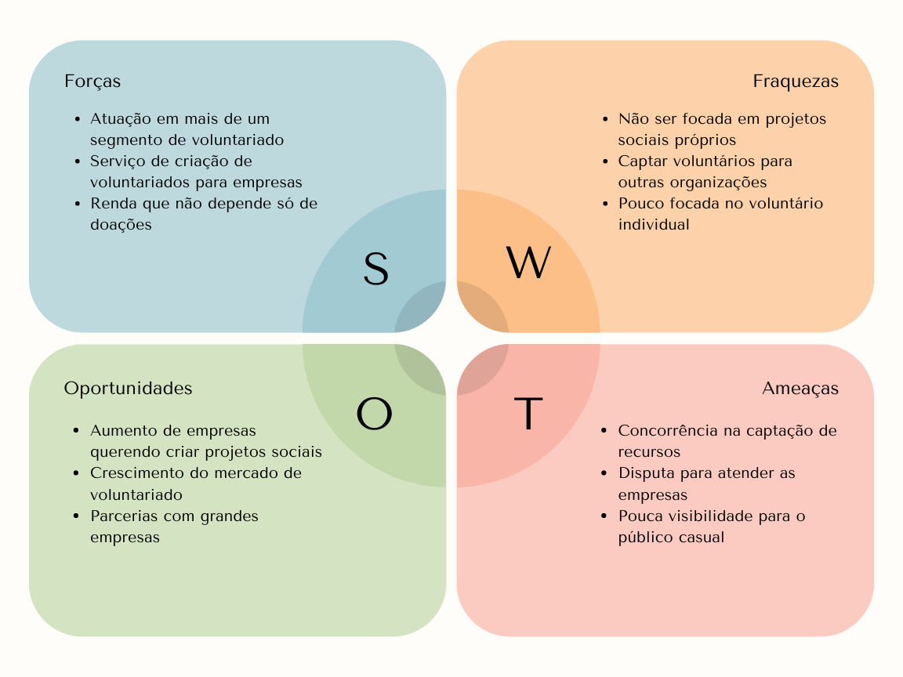 
   
   <sup>Fonte: Material produzido pelos autores (2024)</sup>
   
</div>

**Forças:**

- Atuação em mais de um segmento de voluntariado: A empresa parceira se diversifica em setores diferentes de contribuições sociais, atraindo diferentes públicos de ONGs, empresas e voluntários.
- Serviço de criação de voluntários para empresas: Possui um serviço voltado para empresas e instituições, permitindo absorver um segmento diferente do mercado.
- Renda que não depende só de doações: Devido a diversificação apresentada, a ONG possui renda por serviços para instituições e empresas, reduzindo sua dependência de doações externas para custear suas atividades.

**Fraquezas:**

- Não ser focada em projetos sociais próprios: A empresa possui menos foco em projetos próprios que os concorrentes, potencialmente causando menores aportes de doação.
- Captar voluntários para outras organizações: Devido a seu modelo de atuação, os voluntários atraídos são redirecionados a outras causas, não contribuindo com o parceiro diretamente.
- Pouco focada no voluntário individual: Maior ênfase em instituições do que na pessoa física, potencialmente não sendo tão conhecida pelo público geral.

**Oportunidades:**

- Aumento de empresas querendo criar projetos sociais: Cada vez mais, empresas estão buscando ter projetos de cunho social, aumentando a demanda por um dos serviços da parceira.
- Crescimento do mercado de voluntariado: Estar em um mercado em crescimento entre as instituições e as pessoas físicas.
- Parcerias com grandes empresas: Já possuir parcerias e contatos com grandes empresas devido a trabalhos passados.

**Ameaças:**

- Concorrência na captação de recursos: Disputa com outras ONGs pelas doações e aportes financeiros para manter suas atuações.
- Disputa para atender às empresas: Competição com os concorrentes para firmar parcerias com as empresas e montar seus projetos sociais.
- Pouca visibilidade para o público casual: Não ser tão conhecida pelos voluntários em si, devido a menor atuação direta com essa parcela do setor.

### 2.1.4. Solução (sprints 1 a 5):

&nbsp;&nbsp;&nbsp;&nbsp;Nesse subtópico abordaremos todos os aspectos que englobam uma solução completa, partindo do problema e dos dados, até a solução em si e sua forma de metrificação de sucesso.

1. O problema a ser resolvido pelo projeto é a falta de centralização daqueles envolvidos no universo do voluntariado, principalmente em relação ao voluntário enquanto indivíduo. Isso se deve pela falta de ambientes voltados à interconexão entre ONGs, voluntários e projetos, sendo as poucas existentes focadas apenas na perspectiva da ONG e sua captação de voluntários.
2. Não se aplica (o parceiro não disponibilizou dados que apoiem a plataforma em si, somente dados vagos da contabilidade da empresa que não contribuem para o tópico).
3. A solução proposta por nossa equipe é a criação de uma plataforma estilo LinkedIn dedicada à centralização dos atores do mercado de Voluntariado, com ênfase no voluntário; permitindo que voluntários e organizações divulguem ações sociais, exponham seu currículo de projetos sociais para os demais e busquem por projetos, pessoas e ONGs que se alinham com suas causas.
4. A solução deve ser utilizada através de uma plataforma web, em que o usuário deverá criar sua conta e, a partir dela, interagir com os demais recursos, sendo estes: a edição do perfil; a criação do perfil de ONG; a criação e divulgação de vagas em projetos individuais e de organizações; e a busca por voluntários e projetos.
5. Os benefícios trazidos pela solução proposta são a facilitação do contato entre a comunidade voluntária e projetos de impacto em todas as escalas, juntamente com a mensuração desse impacto. Isso se deve a facilidade de divulgação e engajamento de projetos por qualquer usuário e a centralização dos dados de do setor em um único ambiente.
6. O critério de avaliação da plataforma proposta será o número de empresas e voluntários inscritos, o número de projetos registrados, o volume de engajamento em projetos e o número de horas voluntárias acumuladas. Essas métricas todas serão geradas pela própria infraestrutura de dados da plataforma, facilitando a obtenção dos dados devido a sua centralização para análise.

### 2.1.5. Proposta de Valor (sprint 1)

&nbsp;&nbsp;&nbsp;&nbsp;Esta seção introduz uma ferramenta estratégica essencial para o desenvolvimento de aplicações web, fornecendo uma visão concisa de como a aplicação entrega valor aos usuários. O Canvas Proposta de Valor é um modelo visual que destaca os problemas dos usuários, os benefícios oferecidos, os diferenciais competitivos e como a aplicação se posiciona no mercado. Ao preencher este modelo, os desenvolvedores podem obter insights cruciais para orientar as decisões de design, funcionalidades e estratégias de marketing, resultando em produtos web mais alinhados com as necessidades dos usuários e mais competitivos no mercado (Osterwalder, 2019).

<div align="center">
   
   <sub>Figura X - Canvas proposta de valor</sub>

   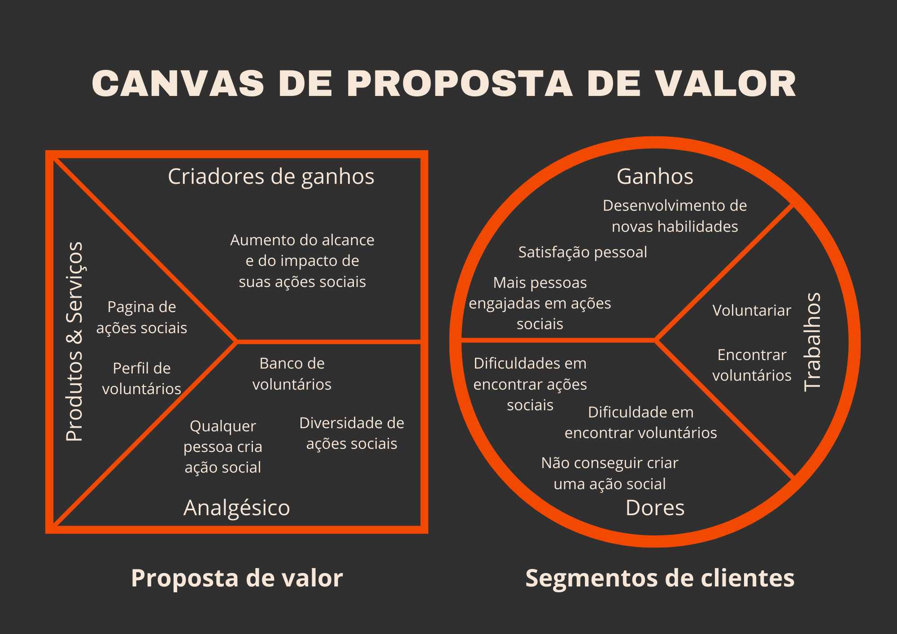 
   
   <sup>Fonte: Material produzido pelos autores (2024)</sup>
   
</div>

&nbsp;&nbsp;&nbsp;&nbsp;**Segmentos de Clientes:**

&nbsp;&nbsp;&nbsp;&nbsp;O segmento de clientes da aplicação web é composto por pessoas interessadas em participar de ações sociais e voluntariado. São pessoas que buscam oportunidades de ajudar o próximo e se engajar em causas sociais.

- Ganhos:
  1. Mais pessoas engajadas em ações sociais: facilidade de encontrar ações sociais e se conectar com pessoas que compartilham os mesmos interesses.
  2. Desenvolvimento de habilidades: oportunidade de aprender novas habilidades e se desenvolver pessoalmente.
  3. Satisfação pessoal: sensação de dever cumprido ao ajudar o próximo.
- Dores:
  1. Dificuldade de encontrar ações sociais: falta de informação sobre ações sociais disponíveis.
  2. Dificuldade em encontrar voluntários: dificuldade em encontrar pessoas interessadas em participar de ações sociais.
  3. Não conseguir criar ações sociais: dificuldade em criar ações sociais e mobilizar pessoas para participar.
- Trabalhos:
  1. Voluntariar: participar de ações sociais e ajudar o próximo.
  2. Criar ações sociais: criar ações sociais e mobilizar pessoas para participar.

&nbsp;&nbsp;&nbsp;&nbsp;**Proposta de Valor:**
&nbsp;&nbsp;&nbsp;&nbsp;A proposta de valor da aplicação web é facilitar o engajamento em ações sociais e voluntariado, conectando pessoas interessadas em participar de ações sociais e criar oportunidades para ajudar o próximo.

- Criadores de ganhos:

  1. Aumento do alcance e do impacto das ações sociais: facilitar a conexão entre pessoas interessadas em participar de ações sociais e criar oportunidades para ajudar o próximo.

- Analgésicos:

  1. Banco de voluntários: facilitar a busca por voluntários interessados em participar de ações sociais.
  2. Diversidade de ações sociais: oferecer uma variedade de ações sociais para que as pessoas possam escolher aquelas que mais se identificam.
  3. Qualquer pessoa pode criar ações sociais: permitir que qualquer pessoa crie ações sociais e mobilize pessoas para participar.

- Produtos e Serviços:
  1. Cadastro de voluntários: permitir que as pessoas se cadastrem como voluntários e encontrem ações sociais para participar.
  2. Cadastro de ações sociais: permitir que as pessoas criem ações sociais e mobilizem voluntários para participar.

### 2.1.6. Matriz de Riscos (sprint 1)

&nbsp;&nbsp;&nbsp;&nbsp; De acordo com os autores Tomaz; Gagliasso; Malavota (2020), a Matriz de risco é uma ferramenta de gestão que auxilia um grupo em um projeto a identificar os riscos e ameaças que possam afetar negativamente um projeto. A matriz de riscos é construída através da análise da probabilidade de algo acontecer e do impacto caso esse algo aconteça. Ainda de acordo com os autores, é importante ressaltar que a elaboração de uma matriz de riscos é um processo iterativo, ou seja, acontece várias vezes durante o desenvolvimento do projeto, a fim de sempre se manter atualizado em quais riscos ainda são relevantes e quais deixaram de ser. Neste projeto, decidimos analisar e atualizar a matriz no começo de cada sprint.

<div align="center">
   
   <sub>Figura X - Matriz de Risco do Projeto </sub>

   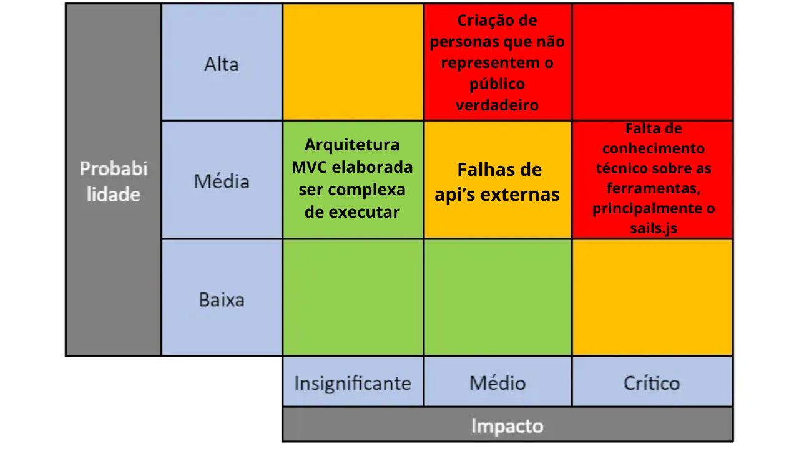 
   
   <sup>Fonte: Adaptado de <a href="https://certificacaoiso.com.br/matriz-de-riscos-o-que-e-e-como-aplicar/">Templum</a> (2024)</sup>
   
</div>

&nbsp;&nbsp;&nbsp;&nbsp;Para a primeira sprint do projeto, identificamos os seguintes riscos e elencamos planos de ação para cada um deles: <br>

- Falta de conhecimento técnico sobre as ferramentas, principalmente o sails.js

  - É possível que tenhamos dificuldade em desenvolver a plataforma por ainda não termos tido contato com ferramentas como, por exemplo, o framework de backend Sails.js. Caso tenhamos essas dificuldades, o principal plano de ação é solicitar auxílio dos professores, bem como pedir a disponibilização de materiais complementares que nos ajudem a estudar sobre.

- Elaboração de personas que não representem, de fato, os usuários da plataforma & utilização de proto personas

  - A utilização de proto personas indica que não elaboramos personas (usuários fictícios) com base em dados, mas sim em nossas próprias expectativas e experiência. Apesar de ainda ser um método válido, pode causar a criação de personas que não representem, de fato, os usuários. Caso isso aconteça, iremos recorrer a métodos de pesquisa a fim de criar personas qualitativas.

- Falhas de segurança em página de login e falhas de API's externas

  - Caso optemos por deixar o login na plataforma nas mão de terceiros (por exemplo, fazer o login e autenticação utilizando da tecnologia _Firebase_), a falha dessas aplicações também representam um risco para o projeto. Nesse caso, o plano de ação seria trocar a api problemática e encontrar alguma que possa substituí-la.

- Esboçar uma primeira arquitetura MVC que não esteja de acordo com o que o cliente quer
  - A arquitetura de software em padrão MVC consiste em identificar 3 camadas para o seu software e quais funcionalidades cada uma terá e é a partir disso que se começa a, de fato, programar a solução. Uma arquitetura MVC mal feita pode levar a muita confusão ao se programar a plataforma. Caso isso aconteça, o ideal seria revisar a arquitetura antes de começar a programar novamente.

&nbsp;&nbsp;&nbsp;&nbsp;Além de uma matriz de riscos, também elaboramos uma matriz de oportunidades, que tem como objetivo identificar quais elementos mais podem beneficiar o nosso projeto. Além disso, a matriz é elencada também a partir de impacto e probabilidade, ressaltando que devemos dar mais atenção para oportunidades que possuam maior probabilidade e maior impacto.

### 2.1.7 Matriz de Riscos (sprint 2)

<div align="center">
   
   <sub>Figura X - Matriz de Risco do Projeto na sprint 2 </sub>

   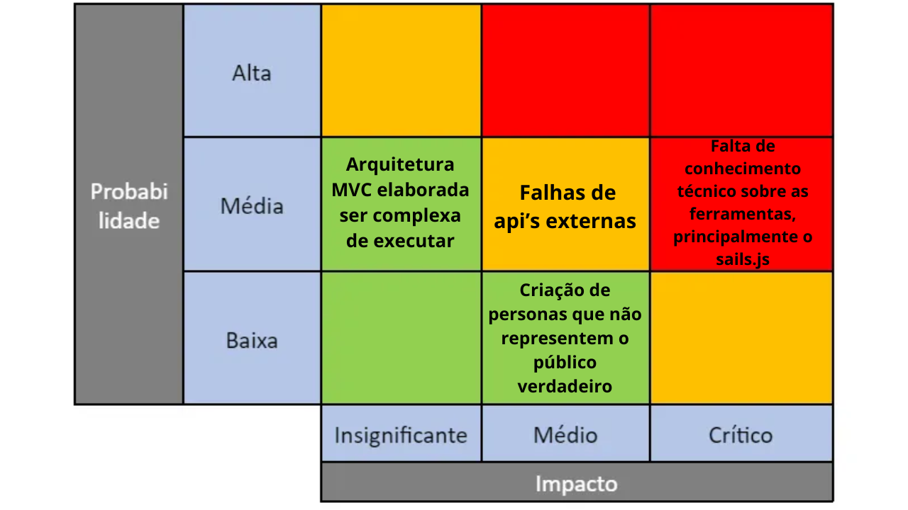 
   
   <sup>Fonte: Adaptado de <a href="https://certificacaoiso.com.br/matriz-de-riscos-o-que-e-e-como-aplicar/">Templum</a> (2024)</sup>
   
</div>

&nbsp;&nbsp;&nbsp;&nbsp;Na segunda sprint do projeto, após já ter passado por uma primeira validação com o parceiro, passamos a entender que o risco de criar personas que não representem o público verdadeiro passa a ser de baixa probabilidade, uma vez que o parceiro aprovou as nossas personas. Dessa forma, esse risco "desceu" na tabela, sendo esta a única atualização que fizemos desde a primeira sprint.

### 2.1.9 Matriz de Riscos (sprint 3)

<div align="center">
   
   <sub>Figura X - Matriz de Risco do Projeto na sprint 3 </sub>

   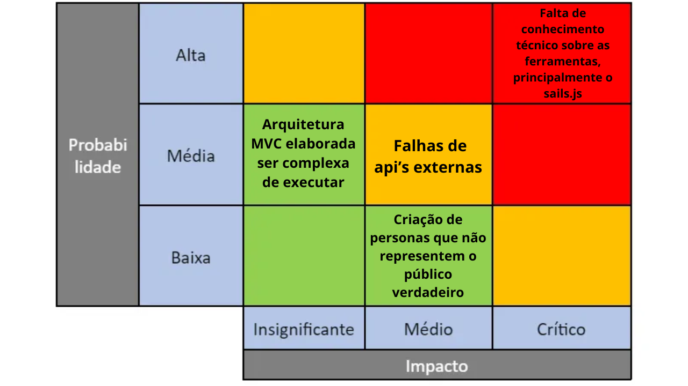 
   
   <sup>Fonte: Adaptado de <a href="https://certificacaoiso.com.br/matriz-de-riscos-o-que-e-e-como-aplicar/">Templum</a> (2024)</sup>
   
</div>

&nbsp;&nbsp;&nbsp;&nbsp;Para a terceira sprint do projeto, realizamos mais uma alteração na matriz de riscos. Durante o desenvolvimento do *back-end* da aplicação, percebemos que a ferramenta escolhida, o SailsJs, seria muito mais difícil de se aprender do que esperávamos. Dessa forma, o risco de falta de conhecimento técnico sobre as ferramentas, que já havia sido apontado desde a primeira sprint, passa a estar no ponto mais crítico da matriz: maior probabilidade de acontecer e maior impacto no projeto. 

### 2.1.10 Matriz de Oportunidades

<div align="center">
   
   <sub>Figura X - Matriz de Oportunidades do Projeto </sub>

   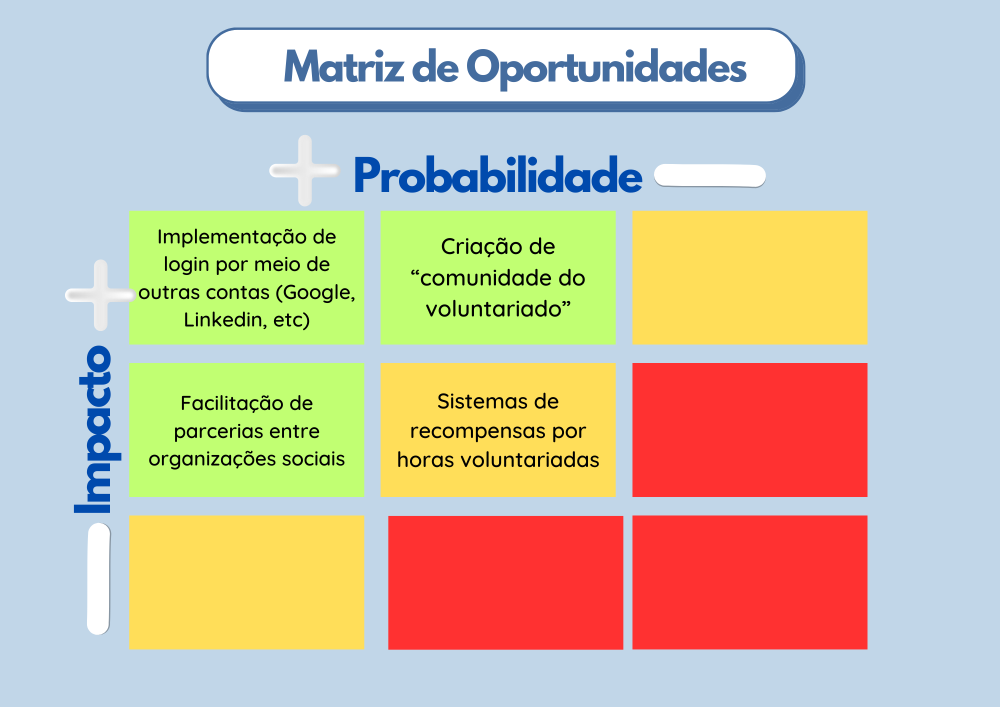 
   
   <sup>Fonte: Material produzido pelos autores (2024)</sup>
   
</div>

&nbsp;&nbsp;&nbsp;&nbsp;**Na primeira sprint, identificamos as possíveis oportunidades:** <br>

- Implementação de login por meio de outras contas:
  - Podemos nos aproveitar da utilização de API's externas para implementar funcionalidades como login na nossa plataforma via conta do Google ou conta do Linkedin.
- Criação de “comunidade do voluntariado”:
  - Por meio da interação entre o voluntariado presente na plataforma, percebemos a grande possibilidade de criar um sentimento de comunidade entre eles, o que possibilitaria uma interação maior entre usuários, proporcionando _networking_ e uma rede de aprendizados.
- Facilitação de parcerias entre organizações sociais:
  - Como a ideia é que várias organizações sociais usem a plataforma, identificamos uma possibilidade de a solução desenvolvida vir a se tornar um espaço de conexão e firmamento de parcerias entre essas diversas organizações.
- Sistemas de recompensas por horas voluntariadas:
  - Assim como idealizado em conversas com o parceiro de projeto, identificamos uma oportunidade em trazer espécies de recompensas para cada conquista que o usuário obter na plataforma. Um exemplo seria fornecer uma insígnia ou _badge_ quando o usuário atingir uma quantidade específica de horas voluntariadas.

## 2.2. Personas (sprint 1)

&nbsp;&nbsp;&nbsp;&nbsp;Uma persona é uma descrição fictícia, porém realista, de um usuário típico ou pertencente ao público-alvo de um produto. Essa descrição deve conter elementos como necessidades, preocupações, objetivos e informações como idade, gênero e trabalho. No desenvolvimento de um projeto, as personas são utilizadas para entender como que um provável usuário da plataforma pensa e quais funcionalidades seriam mais importantes para ele. Dessa forma, podemos desenvolver a solução de maneira centrada no usuário, focando em resolver os problemas que este possui no dia-a-dia (Harley, 2015). <br>
&nbsp;&nbsp;&nbsp;&nbsp;Para o nosso projeto, elaboramos 4 principais proto personas. Uma proto persona é aquela que foi criada a partir do conhecimento já existente do time, baseando-se principalmente em conversas com o parceiro de projeto e no próprio TAPI (Termo de Abertura de Projeto do Inteli). É importante ressaltar que em nenhum momento o grupo realizou uma coleta de dados recentes por meio de pesquisas ou ferramentas semelhantes. Dessa forma, as seguintes personas foram desenvolvidas: 

<div align="center">
   
   <sub>Figura X - Persona: Laura Silva </sub>

   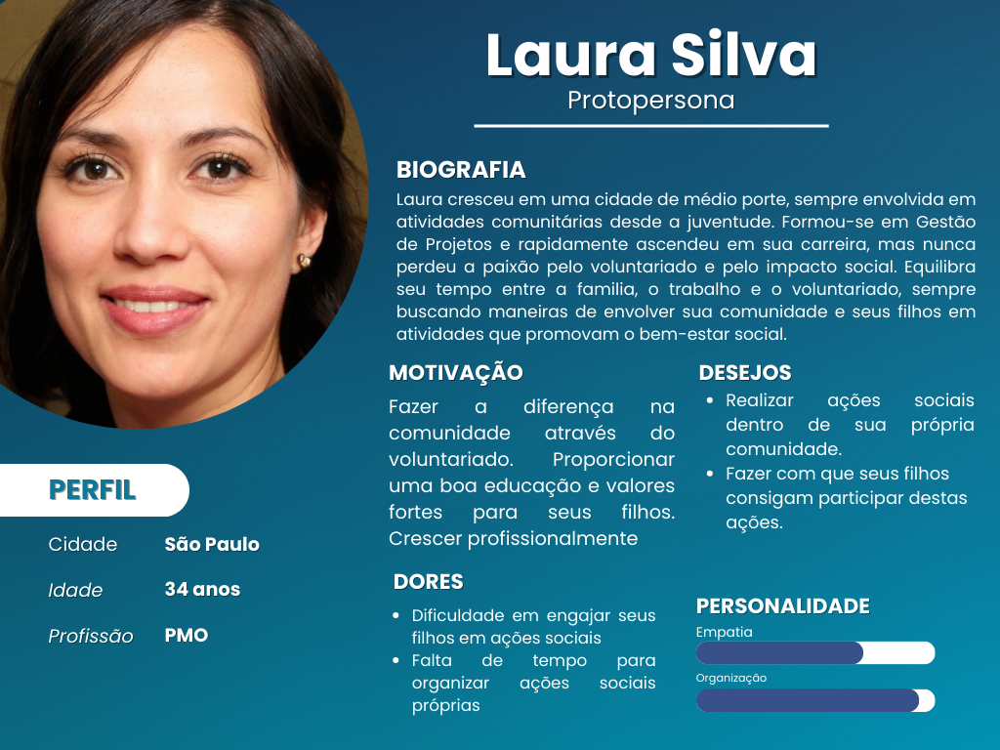 
   
   <sup>Fonte: Material produzido pelos autores (2024)</sup>
   
</div>
<div align="center">
   
   <sub>Figura X - Persona: Taylor Alonso </sub>

   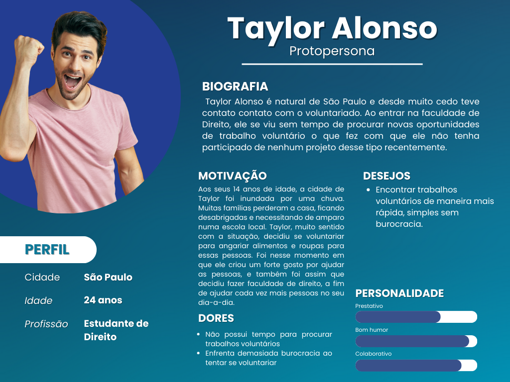 
   
   <sup>Fonte: Material produzido pelos autores (2024)</sup>
   
</div>

<div align="center">
   
   <sub>Figura X - Persona: Rogério Scrum </sub>

    
   
   <sup>Fonte: Material produzido pelos autores (2024)</sup>
   
</div>
&nbsp;&nbsp;&nbsp;&nbsp;Por fim, ressaltamos que cada uma dessas personas foi elaborada a fim de cobrir um gênero específico de usuário da plataforma. Enquanto o Taylor Alonso é do tipo que utiliza a plataforma para encontrar trabalhos voluntários, se inscrever neles e utilizar o seu perfil para mostrar aos outros no que tem trabalhado, o Rogério Scrum representa aqueles usuários que fazem parte ou representam uma organização social em busca de novos voluntários para as suas ações.

## 2.3. User Stories (sprints 1 a 5)

&nbsp;&nbsp;&nbsp;&nbsp;Em seu livro *User Stories Applied: For Agile Software Development* (2004), Mike Cohn fala sobre como *user stories* são fundamentais para se construir uma aplicação que resolva os problemas de um usuário. Elas servem para quais funcionalidades um possível usuário gostaria de ter na plataforma e como tal funcionalidade criaria ganho para ele. Uma *user story* é basicamente um texto que segue o formato "Como [pessoa pertencente a um perfil], gostaria de [fazer tal ação/ter tal funcionalidade] a fim [ganho gerado].

&nbsp;&nbsp;&nbsp;&nbsp;A partir das personas desenvolvidas, foram planejadas User Stories (histórias do usuário) que fossem coerentes com aquilo que elas desejariam para a plataforma web. Partir da perspectiva desse usuário ficcional é de suma importância para garantir uma maior fidelidade entre o produto desenvolvido e as necessidades de seu público, de forma a guiar os rumos do desenvolvimento ao longo de toda a jornada do projeto. Assim como elementos como a matriz de riscos, as *user stories* também são iterativas e atualizadas no decorrer do projeto. 

Identificação | US01
--- | ---
Persona | Rogério Scrum
User Story | "Como diretor de uma ONG, quero cadastrar a minha ONG na plataforma, a fim de trazer mais visibilidade para a organização"
Critério de aceite 1 | CR1: O usuário, já cadastrado na plataforma, deve ter a opção de criar uma página para uma ONG. A página, após criada, deve estar visível para os demais usuários e editável para o criador
Teste | O usuário, ao clicar na opção de ONG, deve, ou conseguir preencher os dados necessários, criando o perfil da ONG para completar, ou ser capaz de editar os campos que clicar da sua ONG já existente.

Identificação | US02
--- | ---
Persona | Rogério Scrum
User Story | "Como diretor de uma ONG, gostaria de cadastrar uma ação social em nome da minha ONG na plataforma, a fim de divulgá-la e angariar mais voluntários para a causa"
Critério de aceite 1 | CR1: O usuário, já cadastrado na plataforma e através da página de sua ONG, deve poder acessar uma página para criação de ações. 
Teste | Usando a página da ONG, o usuário deve clicar na página de ações e editar ou criar seu projeto. Essas mudanças, assim que concluídas, devem ficar visíveis a todos os usuários cadastrados na plataforma.

Identificação | US03
--- | ---
Persona | Rogério Scrum
User Story | "Como diretor de uma ONG, gostaria de encontrar voluntários disponíveis para trabalhar em causas sociais específicas, de modo a identificar potenciais colaboradores para a minha ONG"
Critério de aceite 1 | CR1: O usuário, já cadastrado, deve poder pesquisar por usuários, filtrando-os por critérios diversos, tais como habilidades, localização, interesses, etc
Teste |  O usuário deve clicar na barra de pesquisa e adicionar os filtros desejados, clicar em procurar e uma lista de voluntários disponíveis deve aparecer na tela

Identificação | US04
--- | ---
Persona | Rogério Scrum
User Story | "Como diretor de uma ONG, gostaria de convidar voluntários promissores para engajarem nas ações sociais da minha ONG, com o intuito de trazer voluntários que agreguem valor à minha organização"
Critério de aceite 1 | CR1: O usuário, já cadastrado e após ter procurado por voluntários deve poder enviar uma comunicação individual que os chame para trabalhar voluntariamente em uma determinada vaga
Critério de aceite 2 | CR2: O usuário voluntário deve receber uma notificação na plataforma sempre que for convidado para uma ação ou projeto
Teste | O usuário criador de uma ação deve clicar no perfil de um usuário voluntário e clicar no botão de convidar. Após isso, ele especifica para qual ação ele deseja chamar o voluntário e envia o convite (aparece como notificação para o voluntário)

Identificação | US05
--- | ---
Persona | Taylor Alonso
User Story | "Como universitário que deseja se voluntariar, gostaria de criar um perfil na plataforma, a fim de poder exibir os trabalhos que já fiz, informações como a quantidade de horas que já trabalhei e obter reconhecimento por isso"
Critério de aceite 1 | CR1: Ao acessar a página de cadastro, o usuário deve poder inserir seus dados e enviá-los
Critério de aceite 2 | CR2: Ao entrar na plataforma, o usuário já possuirá um perfil vazio
Critério de aceite 3 | CR3: Conseguir cadastrar e inserir quaisquer informações de seu perfil na plataforma
Teste | Ao criar a sua conta, o usuário deve poder clicar em seu perfil, podendo escolher os campos que se deseja preencher ou editar, assim como interagir com os outros elementos via clique

Identificação | US06
--- | ---
Persona | Taylor Alonso
User Story | "Como universitário que deseja se voluntariar, gostaria de editar as informações do meu perfil na plataforma, a fim de mantê-lo atualizado com as mais recentes informações sobre os meus voluntariados"
Critério de aceite 1 | CR1: Conseguir acessar o perfil e editar qualquer campo disponível. Após a atualização, outros usuários que acessarem o seu perfil já devem ver a informação atualizada
Teste | Após de finalizar o perfil, poder clicar para acessá-lo e alterar qualquer dado necessário

Identificação | US07
--- | ---
Persona | Taylor Alonso
User Story | "Como voluntário que possui pouco tempo, gostaria de poder alterar minha disponibilidade de trabalho dependendo da minha rotina, a fim de não receber convites quando não conseguir pegar mais trabalhos ou vice-versa"
Critério de aceite 1 | CR1: Conseguir acessar através do perfil o status de disponibilidade, alterando-o para outra das opções disponíveis
Critério de aceite 2 | CR2: Surgir ao clicar na opção de status as opções de status que podem ser clicadas para alterar
Teste | Clicar na opção de status do perfil; surgir as opções disponíveis; clicar na desejada; mudar o status que aparece no perfil

Identificação | US08
--- | ---
Persona | Laura Silva
User Story | "Como gestora de projetos e voluntária de longa data, gostaria de visualizar todas as oportunidades de trabalho filtradas por áreas disponíveis na plataforma"
Critério de aceite 1 | CR1: Ao acessar a plataforma, conseguir acessar um campo de pesquisa e selecionar os filtros para o tipo de vaga que ela quer. 
Teste | Ao clicar na opção de pesquisa, conseguir selecionar os filtros que procura ou palavras chave, visualizando os perfis correspondentes.

Identificação | US09
--- | ---
Persona | Laura Silva
User Story | "Como gestora de projetos e voluntária de longa data, gostaria de obter detalhamento sobre uma ação em específico na qual estou interessada a fim de conhecer mais e decidir se realmente irei me voluntariar naquele caso"
Critério de aceite 1 | CR1: A usuária, já logada na plataforma e estando na página Home (página onde serão mostradas as ações ocorrendo atualmente) poderá clicar em um card de ação específico e ser redirecionada para a página deste projeto, onde conseguirá mais informações sobre a ação.
Teste | Clicar no card do projeto em questão, sendo redirecionado para a página do projeto

Identificação | US10
--- | ---
Persona | Laura Silva
User Story | "Como gestora de projetos e voluntária de longa data, gostaria de me inscrever em uma ação de voluntariado de minha escolha na plataforma, para poder contribuir com ações que são de meu interesse"
Critério de aceite 1 | CR1: Estando logada na plataforma e após ter obtido o detalhamento sobre alguma ação que a interesse, a usuária deve ser capaz de, por meio de alguns cliques de confirmação, se inscrever como voluntária em uma ação social.
Critério de aceite 2 | CR2: Após ter concluído o passo de se inscrever na ação social, essa ação ficará disponível na página de perfil da usuária caso ela queira mostrar essa informação. 
Teste | Entrar em uma página de detalhamento de uma ação social. Clicar para se candidatar. Preencher os campos de dados necessários. Após isso, seu nome estará na lista de voluntariados e a ação deve estar disponível para publicação em seu perfil. 

Identificação | US11
--- | ---
Persona | Laura Silva
User Story | "Como voluntária que busca colaboradores para minhas ações, gostaria de conseguir editar as ações que criei, de forma a mantê-las atualizadas e coerentes com o estado do meu projeto"
Critério de aceite 1 | CR1: Conseguir selecionar a escolher de edição e alterar as informações dos campos, atualizando o banco de dados ao terminar
Critério de aceite 2 | CR2: Conseguir fechar uma ação para novos candidatos sem apagar a ação, assim como abrir novamente quando necessário
Teste | Ao clicar na opção de edição, conseguir modificar qualquer campo, sendo salvo em seguida; mudar se o projeto está recebendo membros ou não com um clique; encerrar o projeto voluntário

Identificação | US12
--- | ---
Persona | Laura Silva
User Story | "Como voluntária que busca colaboradores para minhas ações, gostaria de conseguir me cadastrar na plataforma a fim de conseguir utilizá-la completamente"
Critério de aceite 1 | CR1: Após acessar a landing page, conseguir acessar a página de login/cadastro
Critério de aceite 2 | CR2: Na tela de cadastro, conseguir inserir as suas informações nos campos e enviar o formulário
Teste | Ao preencher os dados no formulário, deve ser feita uma verificação se tais dados são válidos (campos não podem estar vazios, por exemplo) e esses dados devem ser enviados e estarem presentes no banco de dados. 

&nbsp;&nbsp;&nbsp;&nbsp;As *user stories* nos beneficiam com um desenvolvimento que é centrado no usuário, ou seja, utilizando elas, podemos desenvolver funcionalidades que prováveis usuários da plataforma realmente queiram. Como foi falado anteriormente, as *user stories* são iterativas, ou seja, estão sempre em atualização. É a partir dessas pequenas histórias que, no decorrer das sprints de desenvolvimento, devemos criar *tasks* e implementar funcionalidades na plataforma web. 


# <a name="c3"></a>3. Projeto da Aplicação Web (sprints 1 a 4)

&nbsp;&nbsp;&nbsp;&nbsp;Nessa sessão exploraremos a parte da arquitetura da aplicação web, abordando a forma com que foi modelada toda a estrutura lógica que permite que todos os componentes possam interagir e formar uma solução completa. Esse processo se desdobra desde o aspecto visual até a infraestrutura de dados no servidor, sendo necessário a elaboração de como estas funcionam individualmente e em conjunto para alcançar o objetivo do projeto.

## 3.1. Arquitetura (sprints 1)

**Definição de arquitetura MVC:** <br>
&nbsp;&nbsp;&nbsp;&nbsp;A arquitetura de um software está relacionada a como este é organizado de maneira estrutural e inclui artefatos como os componentes de um software, suas interações e relacionamentos e padrões de design e codificação. Arquitetar o software é a base para qualquer tipo de projeto de um sistema e é algo que influencia aspectos como eficiência, testabilidade e facilidade de manutenção do software. Por conta disso, escolher e implementar de forma correta uma boa arquitetura de software é de suma importância para o projeto (Richards, 2020). <br>
&nbsp;&nbsp;&nbsp;&nbsp;Optamos por desenvolver a nossa solução seguindo o padrão de arquitetura MVC (_Model-View-Controller_). Segundo William Pereira Alves, em seu livro Java Para Web: Desenvolvimento de Aplicações (2018), uma arquitetura de software em padrão em MVC tem como fundamento dividir o software em três camadas principais: _Model_, _View_ e _Controller_. Essa separação nos ajuda por conta de dividir as funcionalidades do produto em setores diferentes e manter uma estrutura organizada, o que torna mais fácil de manter, testar e escalar o software. As funções de cada uma das camadas são:

- Views: As chamadas _views_ são, basicamente, todas as telas que usuário vê e interage, como, por exemplo, uma _landing page_, uma página de cadastro ou uma página de perfil. Tecnicamente falando, são compostas em geral por arquivos HTML/CSS/JS, e pode ser considerado o _front-end_ da aplicação.
- Controllers: É na camada de _controllers_ em que encontramos a "lógica de negócios" da aplicação, ou seja, todas as ações que o usuário pode realizar dentro de uma determinada página. Os _controllers_ são responsáveis por intermediar as comunicações entre cliente (o usuário e seu navegador) e o servidor da aplicação.
- Models: De maneira simplificada, é na camada de _models_ onde ocorre, de fato, a interação com um banco de dados. Quando um _controller_ recebe uma requisição do cliente, ele passa essa requisição para o _model_ que então busca tal informação no banco de dados/servidor da aplicação. A camada de _model_ é a que pode inserir, alterar e deletar dados do banco de dados, e, por isso, não é acessível de maneira direta em nenhum momento para o usuário.<br>

&nbsp;&nbsp;&nbsp;&nbsp;A partir destas definições, fizemos a arquitetura da nossa solução. Vale ressaltar que este também é um processo iterativo que pode sofrer alterações com o decorrer do projeto, uma vez que iremos adquirir mais conhecimento técnico e obter novos requisitos para a plataforma que estamos desenvolvendo. <br>  
**Funcionalidades propostas para a aplicação:** <br>
&nbsp;&nbsp;&nbsp;&nbsp;Um usuário deve poder se cadastrar como voluntário na plataforma e possuir um perfil de voluntário ou organização. Então, ele poderá se mostrar disponível para trabalhos voluntários ou encontrar organizações que já estejam o oferecendo. Além disso, o voluntário pode, de maneira individual, ou representando uma organização, cadastrar alguma ação que ele esteja realizando. Por fim, o usuário terá um perfil que mostre suas estatísticas relacionadas a trabalho voluntário e a plataforma também contará com um contabilizador de todas as horas que foram trabalhadas por intermédio dela.

- Cadastro de usuário
- Se disponibilizar para trabalho voluntário
- Encontrar trabalhos voluntários disponíveis
- Cadastrar uma ação
- Perfil que mostre estatísticas
- Estatísticas gerais da plataforma

<div align="center">
   
   <sub>Figura X - Arquitetura MVC do projeto na sprint 3 </sub>

   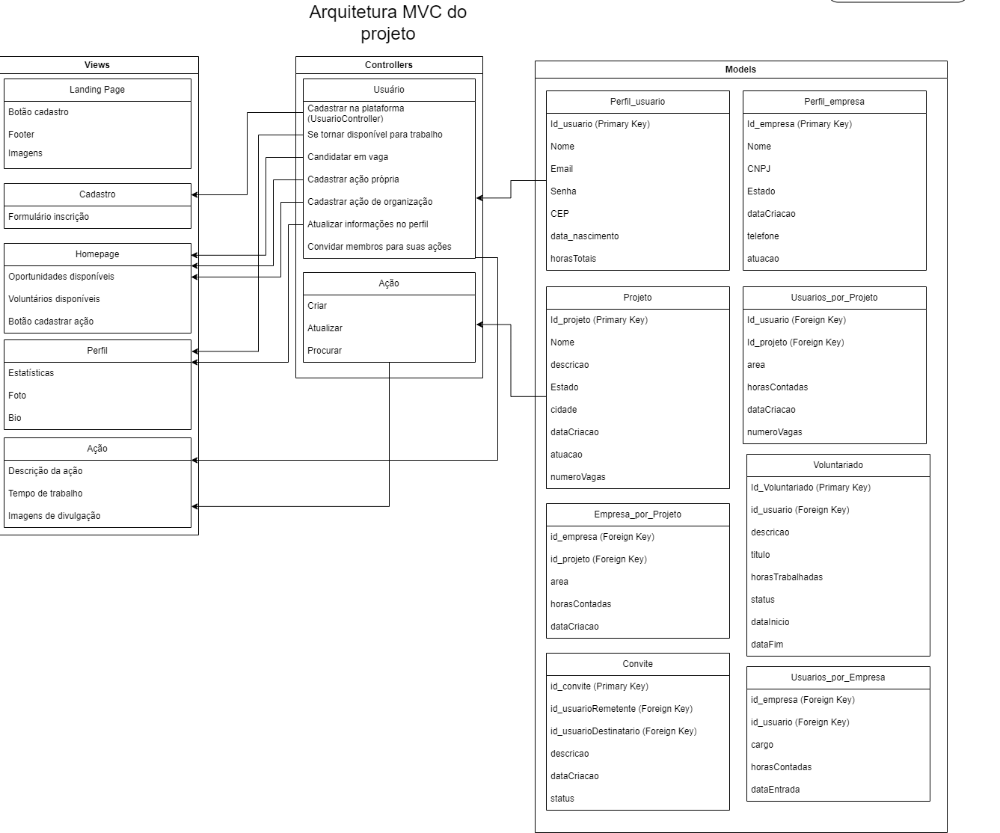 
   
   <sup>Fonte: Material produzido pelos autores (2024)</sup><br>
   <sup>Link: https://drive.google.com/file/d/1H2JQGImOVhsiPtD2n8V--K361aCTO0Q2/view?usp=sharing</sup>

</div>

- Models: Durante a sprint 1, pensamos em duas entidades (tabelas no banco de dados): usuários e ações cadastradas. Já na sprint 3, atualizamos para as seguintes tabelas:

  - Para a tabela Perfil_usuario, os atributos considerados indispensáveis são: Id, nome, email, senha, idade, horas voluntariadas. Essa tabela se refere a qualquer pessoa que utiliza a plataforma, seja um voluntário único ou uma organização. A ideia, na verdade, é que todos que se cadastrem na plataforma façam isso como voluntário. <br>
  - Para a tabela de projetos, temos que uma ação apenas possui um id como _primary key_, nome, descrição, estado, cidade, data de criação, área de atuação e quantidade de vagas <br>
  - Para a tabela Perfil_empresa, temos os atributos id, nome, cnpj, estado, data de criação, telefone para contato e área de atuação.
  - A tabela de Usuarios_por_Projeto é responsável por conectar um usuário com um projeto (ver mais sobre essas relações na seção [4. Desenvolvimento da Aplicação Web](#c4)).
  - A tabela Empresa_por_Projeto é responsável por relacionar os perfis de empresas com os projetos ativos.
  - a tabela Usuarios_por_Empresa vincula os voluntários com as empresas e organizações cadastradas na plataforma.
  - A tabela Convite armazena os dados de um convite enviado de um usuário para o outro, contendo um id proprio e apontando para os dois usários que enviam e recebem o convite. 
  - A tabela Voluntariado armazena as ações de voluntariado que um usuário já participou, contendo dados como descrição, título, horas trabalhadas, status, data de início e fim. 
- Views: Para o projeto, até o momento pensamos em 5 telas:

  - Landing Page: Captar a atenção do usuário e introduzi-lo à finalidade da plataforma
  - Cadastro: Colher informações necessárias para cadastrar o usuário na plataforma e criar o seu perfil
  - Homepage: Mostrar as oportunidades de trabalho disponíveis, os voluntários disponíveis e possibilitar o cadastro de novas ações.
  - Perfil: Mostrar informações (nome, foto, bio) do usuário e estatísticas sobre o mesmo.
  - Ação: Página de uma determinada ação, mostra sua descrição, o tempo de trabalho, imagens e a possibilidade de alguém se candidatar.

- Controllers: Os controladores responsáveis por mediar as interações do usuário na plataforma são os seguintes:

  - Para os usuários:
    - Cadastrar na plataforma - feito por meio do envio de um formulário
    - Se tornar disponível para trabalho - A partir de um botão toggle, que o torna visível para organizações em busca de voluntários
    - Candidatar em vaga - um botão para enviar seus dados para a organização
    - Cadastrar ação própria - um botão para enviar os dados da ação
    - Cadastrar ação de organização - um botão para enviar os dados da ação + organização
    - Atualizar informações no perfil + alterar dados do perfil
    - Convidar membros para suas ações - um botão no perfil de outra pessoa para chamá-la para uma ação sua
  - Para as ações:
    - Criar - criação de ações
    - Atualizar - atualização de parâmetros de uma ação
    - Procurar - procura por ações específicas
  - Na terceira sprint, definimos também os principais controllers a serem usados. Para a nossa arquitetura, possuiremos um controller para cada model. Entretanto, cada controller poderá conter diversas aplicações, como criar, deletar e atualizar informações daquele model específico:

<div align="center">
   
   <sub>Figura X - Models do MVC do projeto na sprint 3 </sub>

    
   
   <sup>Fonte: Material produzido pelos autores (2024)</sup><br>
   <sup>Link: https://drive.google.com/file/d/1H2JQGImOVhsiPtD2n8V--K361aCTO0Q2/view?usp=sharing</sup>

</div>

- Infraestrutura: O projeto possui, até o momento, como componente de infraestrutura um banco de dados relacional gerenciado pelo sistema PostgreSQL, responsável por armazenar em entidades (tabelas) todos os dados necessários de usuários cadastrados na plataforma. No padrão MVC, o banco de dados está presente da camada de Model, nunca podendo ser visível ou interagido pelo usuário. O Model será responsável por fazer consultas e alterar valores no banco de dados por meio de operações de CRUD (Create, Read, Update, Delete).

**Justificativa das escolhas:** <br>
&nbsp;&nbsp;&nbsp;&nbsp;A escolha da arquitetura MVC implica em uma separação de camadas de software muito explícita, o que facilita o entendimento do que cada parte do software faz, podendo fazer, por exemplo, a separação do que é visível para o usuário e o que é regra de negócio.<br>
&nbsp;&nbsp;&nbsp;Em relação a escalabilidade, a separação do software em camadas permite uma maior modularização e reaproveitamento de código, de forma que cada camada pode ser escalada individualmente.<br>
&nbsp;&nbsp;&nbsp;&nbsp;Sobre a questão da manutenção, a arquitetura MVC, também por conta da modularidade citada anteriormente, permite que cada parte do código possa ser isolada e testada individualmente.<br>
&nbsp;&nbsp;&nbsp;&nbsp;Por fim, no que se diz respeito a testabilidade, o MVC permite o desenvolvimento de testes unitários para cada camada do software, o que facilita a testagem da aplicação como um todo.

## 3.2. Wireframes (sprint 1)


&nbsp;&nbsp;&nbsp;&nbsp;Para o contexto deste projeto, um *wireframe* é uma representação de baixa fidelidade da estrutura da página web, contendo informações principalmente acerca de como pretendemos posicionar os principais elementos na tela. Um *wireframe* não tem finalidade de demonstrar exatamente como a página web seria esteticamente, mas sim apenas apresentar como seria o *layout* da página e fornecer uma orientação para o momento do desenvolvimento tanto da página web como de um protótipo de alta fidelidade. Ainda neste contexto, um *wireflow* é uma representação que mostra as diferentes telas e etapas da execução de uma determinada funcionalidade da plataforma (Guimarães, 2019). <br>
&nbsp;&nbsp;&nbsp;&nbsp;A seguir, disponibilizamos um *wireflow* referente a idealização de funcionalidade de cadastro de ações sociais e vários outros *wireframes* de páginas únicas. Além disso, segue o link para visualização dos *wireframes* em uma página do Figma: <a href="https://www.figma.com/file/wN6wqurUq4HjiH0k1QbOWx/CSS-%7C-VTM-PV-Project?type=design&node-id=1%3A4&mode=design&t=D0fj8EpfnPwhxLqT-1">https://www.figma.com/file/wN6wqurUq4HjiH0k1QbOWx/CSS-%7C-VTM-PV-Project?type=design&node-id=1%3A4&mode=design&t=D0fj8EpfnPwhxLqT-1 </a>


<div align="center">
   
   <sub>Figura X -Wireframa da Landing Page </sub>

   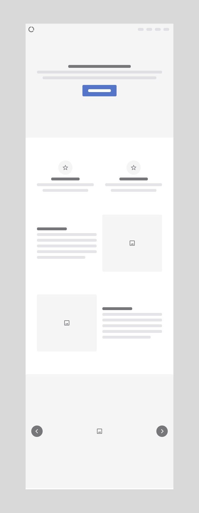 
   
   <sup>Fonte: Material produzido pelos autores (2024)</sup><br>

</div>

&nbsp;&nbsp;&nbsp;&nbsp;A *landing page* é, de fato, a primeira tela que o usuário vê quando busca pela plataforma. É nessa página onde ele consegue informações sobre a plataforma e dados sobre os projetos que já estão sendo realizados. Também é a partir da *landing page* que o usuário segue para a página de cadastro/login. No wireframe acima, temos o posicionamento dos principais elementos de uma *landing page*, tais como uma *hero section*, testemunhos e um carrossel de imagens de ações realizadas na plataforma. 


<div align="center">
   
   <sub>Figura X -Wireframa do Perfil do Usuário </sub>

   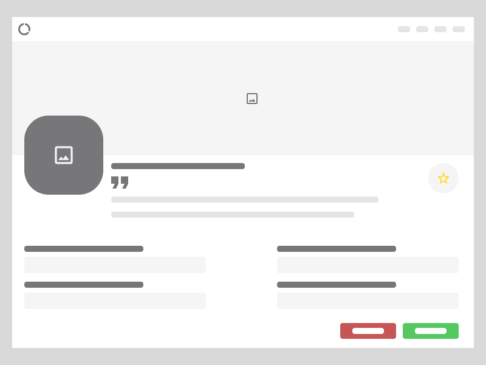 
   
   <sup>Fonte: Material produzido pelos autores (2024)</sup><br>

</div>

&nbsp;&nbsp;&nbsp;&nbsp;O wireframe acima mostra a ideia de posicionamento dos elementos na tela de perfil de usuário, demonstrando a ideia de ter um perfil com uma foto do usuário e uma foto de capa, bem como uma descrição sua e de suas ações realizadas. Os botões na parte inferior estarão presentes no momento de edição do perfil, tendo como funcionalidade salvar ou descartar as alterações.

<div align="center">
   
   <sub>Figura X - Wireflow do cadastro de uma ação social </sub>

   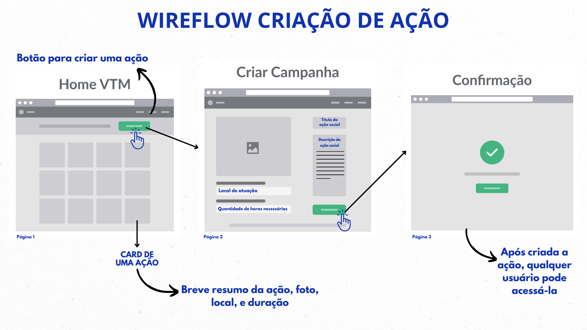 
   
   <sup>Fonte: Material produzido pelos autores (2024)</sup><br>

</div>

&nbsp;&nbsp;&nbsp;&nbsp; Para este _wireflow_, decidimos seguir a _user story_ 02, da persona Rogério Scrum, que trata da funcionalidade de cadastrar uma nova ação social dentro da plataforma. <br>
&nbsp;&nbsp;&nbsp;&nbsp; Já na página _home_ do website, local onde são mostradas diversas oportunidades de voluntariado e voluntários que estão disponíveis, uma pessoa individual ou responsável por uma organização social pode clicar em um botão de "Cadastrar nova ação" e então será levado para uma outra página, onde ele deve inserir os dados da ação, tais como título, descrição, local de atuação e quantidade de horas de trabalho necessária. Por fim, ao clicar no botão de finalização, o usuário é levado para uma tela de confirmação, que indica que a ação foi criada com sucesso e agora está visível para os usuários da plataforma.

<div align="center">
   
   <sub>Figura X - Wireframe login desktop </sub>

   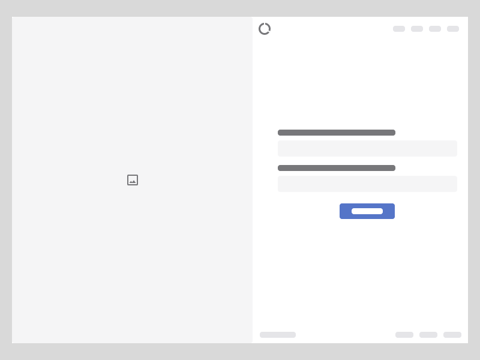 
   
   <sup>Fonte: Material produzido pelos autores (2024)</sup><br>

</div>

<div align="center">
   
   <sub>Figura X - Wireframe login mobile </sub>

   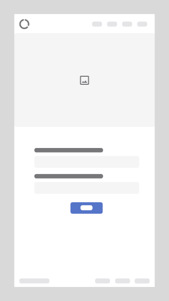 
   
   <sup>Fonte: Material produzido pelos autores (2024)</sup><br>

</div>

&nbsp;&nbsp;&nbsp;&nbsp;Os wireframes da tela de login foram pensados para serem simples, chamativos e intuitivos. A tela atende esses requisitos ao possuir apenas uma grande imagem chamativa à esquerda e o formulário de cadastro/login ao lado.

<div align="center">
   
   <sub>Figura X - Wireflow User Story 3: Filtrar usuário </sub>

   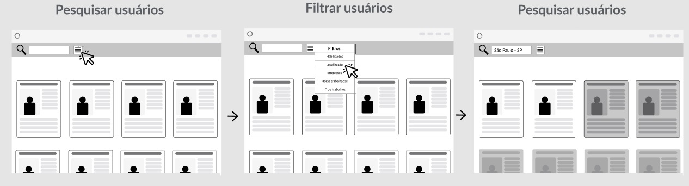 
   
   <sup>Fonte: Material produzido pelos autores (2024)</sup><br>

</div>


&nbsp;&nbsp;&nbsp;&nbsp;Por fim, trazemos um wireflow baseado da *user story* 03, também da persona Rogério Scrum e que fala sobre como um usuário da plataforma deve poder, por meio de pesquisas e filtros, encontrar voluntários disponíveis no site. A ideia é que essa seja também um versão da *home* da aplicação, onde aquele que estiver pesquisando pode escolher por filtrar os *cards* em voluntários ou ações sociais. Em cada caso, ele também pode adicionar mais filtros, como por exemplo um filtro de áreas de interesse. Dessa forma, por exemplo, um responsável por uma ONG de cuidados de animais pode encontrar, nesta página, voluntários que se interessem pela causa animal ao pesquisar voluntários com esse filtro. No wireflow acima, o usuário escolheu um filtro de localização e selecionou os voluntários da região de São Paulo - SP. Dessa forma, os voluntários que não correspondem ao filtro ficariam indisponíveis.


## 3.3. Guia de estilos (sprints 2 e 3)

&nbsp;&nbsp;&nbsp;&nbsp;Um guia de estilos é um documento que fala sobre as regras de design de um produto ou projeto. Esse documento é, primariamente, utilizado como uma maneira de guardar todas definições de design que devem ser estendidas a todo o projeto. Um guia de estilos deve conter elementos como a paleta de cores do projeto, sua tipografia (fontes, tamanhos, pesos e famílias de fontes) e os ícones que devem ser utilizados bem como orientações sobre _grids e breakpoints_ e como aplicar esses estilos no desenvolvimento do produto. <br>
&nbsp;&nbsp;&nbsp;&nbsp;Dessa forma, no guia de estilos deste projeto, trazemos as principais cores, fontes e ícones que devem ser usadas no seu desenvolvimento atual e futuro a fim de manter uma padronização e uma identidade de marca da plataforma. É importante ressaltar que uma boa parte das decisões tomadas acerca dos elementos que compõem o guia de estilos foram baseadas no próprio _brand guidelines_ da organização Parceiros Voluntários, porém contendo pequenas modificações que buscam trazer originalidade para o produto mas sem tirar a identidade do parceiro de projeto. <br>
&nbsp;&nbsp;&nbsp;&nbsp;Para visualização completa do guia de estilos e de outros elementos de design, o link a seguir disponibiliza a página do projeto na plataforma Figma: <a href="https://www.figma.com/file/wN6wqurUq4HjiH0k1QbOWx/CSS-%7C-VTM-PV-Project?type=design&node-id=0%3A1&mode=design&t=7Acaw4O9gUECW94t-1"> https://www.figma.com/file/wN6wqurUq4HjiH0k1QbOWx/CSS-%7C-VTM-PV-Project?type=design&node-id=0%3A1&mode=design&t=7Acaw4O9gUECW94t-1 </a>

### 3.3.1 Cores

&nbsp;&nbsp;&nbsp;&nbsp;Num guia de estilos, as cores aparecem como um dos, senão o, elemento principal da marca. As cores, a depender do contexto em que são usadas, podem passar diversos sentimentos ao usuário, tais como calma ou até mesmo caos. <br>
&nbsp;&nbsp;&nbsp;&nbsp;Apesar de não ser uma regra definitiva, é comum um guia de estilos possuir cores primárias, secundárias e terciárias. Para este projeto, definimos 5 cores, sendo 1 primária, 1 secundária e 1 terciária como principais, e 1 secundária e 1 terciária como complementares. Além disso, também definimos um elemento neutro. 


<div align="center">
   
   <sub>Figura X - Paleta de Cores do Projeto </sub>

    
   
   <sup>Fonte: Material produzido pelos autores (2024)</sup><br>

</div>

<div align="center">
   
   <sub>Figura X - Aplicação das Cores do Projeto </sub>

    
   
   <sup>Fonte: Material produzido pelos autores (2024)</sup><br>

</div>

<div align="center">
   
   <sub>Figura X - Aplicação das Cores do Projeto </sub>

    
   
   <sup>Fonte: Material produzido pelos autores (2024)</sup><br>

</div>

&nbsp;&nbsp;&nbsp;&nbsp;As cores escolhidas são:
* HEX: #002a65 -> Cor principal da plataforma, sendo utilizada em textos de destaque e fundos.
* HEX #ffb422 -> Cor secundária, normalmente utilizada em conjunto com a primária para efeito de contraste e textos chamativos que possuam cor de fundo.
* HEX #0e6053 -> Uma cor primária que servirá de complemente, indicando principalmente a realizações e confirmações de ações realizadas na plataforma.
* HEX #0076e5 -> Também uma cor de complementação, usada, por exemplo, em botões de cadastro e ações mais comuns.
* HEX #992309 -> Cor responsável por indicar ações irreversíveis e chamar a atenção do usuário para o que ele pode estar fazendo na plataforma. 
* HEX #d5d5d5 -> Uma cor neutra para ser usada, quando possível, no lugar do branco, tendo a função de deixar algumas visualizações na página mais confortáveis. 
* Além disso, destacamos algumas aplicações dessas cores, tais como elas podem utilizadas em botões, onde a cor #0076e5 pode ser usada em um botão de cadastro/login e a cor #0e6053 para confirmar as alterações feitas na página de perfil. 

### 3.3.2 Tipografia

&nbsp;&nbsp;&nbsp;&nbsp;A tipografia também é um elemento de suma importância num guia de estilos. É a partir dela que são definidas as fontes de texto que serão utilizadas, levando em consideração diversos aspectos, como espaços, altura das linhas, hierarquia tipográfica, pesos e cores.

<div align="center">
   
   <sub>Figura X - Tipografia do Projeto - League Spartan </sub>

    
   
   <sup>Fonte: Material produzido pelos autores (2024)</sup><br>

</div>


<div align="center">
   
   <sub>Figura X - Tipografia do Projeto - Poppins </sub>

    
   
   <sup>Fonte: Material produzido pelos autores (2024)</sup><br>

</div>

&nbsp;&nbsp;&nbsp;&nbsp;A fonte League Spartan deve ser usada em títulos, subtítulos e trechos de textos menores e que precisem de maior destaque. Já a fonte Poppins deve ser usada em trechos mais densos de textos,
que contenham maior quantidade de palavras.

### 3.3.3 Iconografia e imagens
&nbsp;&nbsp;&nbsp;&nbsp;Numa plataforma web, os ícones são uma forma de se estabelecer uma comunicação visual rápida e dinâmica com o usuário, tendo o papel de rapidamente indicar a funcionalidade de um botão ou de uma seção, por exemplo. Para este projeto, utilizamos o plugin *Phosphor Icons*, da plataforma Figma.   


<div align="center">
   
   <sub>Figura X - Ícones do Projeto </sub>

    
   
   <sup>Fonte: Material produzido pelos autores (2024)</sup><br>

</div>


### 3.3.4 Grids
&nbsp;&nbsp;&nbsp;&nbsp;Quando se está desenvolvendo telas para algum tipo de aplicação, o alinhamento dos componentes na tela é um fator fundamental para garantir uma interface agradável e intuitiva para os usuários. Uma das maneiras de se fazer isso é utilizar um grid ou, em português, uma "grelha". Os grids, em seus variados formatos, tem a função de auxiliar o desenvolvedor/designer a entender como posicionar os elemtos na tela e como distanciar os elementos um dos outros por meio de margens. <br>
&nbsp;&nbsp;&nbsp;&nbsp;Para este projeto, decidimos utilizar dois modelos de grid. Um para desktop e outro para mobile. As configurações dos grids seguem como tal: 
* Desktop: grid de 8 colunas,
128px de margem, 32px de gutter
desktop 1440 x 1024
* Mobile: grid de 4 colunas, 32px de margem,  16px de gutter, Iphone 13 & 14, 390 x 844


<div align="center">
   
   <sub>Figura X - Template de Grid do Projeto </sub>

    
   
   <sup>Fonte: Material produzido pelos autores (2024)</sup><br>

</div>

### 3.3.5 O que não fazer

&nbsp;&nbsp;&nbsp;&nbsp;O guia de estilos serve realmente como um conjunto de regras que um desenvolvedor ou designer deve seguir ao desenvolver a parte gráfica de uma aplicação. Desta forma, ele também deve conter toda sorte de restrições e demonstrar quais comportamentos e aplicaçõs não devem ser replicadas na aplicação. Assim, destacamos aqui alguns casos de "o que não fazer", falando principalmente sobre a utilização de bordas pontiagudas e cores que não contrastem bem entre si.

<div align="center">
   
   <sub>Figura X - Seção Sobre o Que Não Fazer do Projeto </sub>

    
   
   <sup>Fonte: Material produzido pelos autores (2024)</sup><br>

</div>

<div align="center">
   
   <sub>Figura X - Paleta de Cores do Projeto </sub>

    
   
   <sup>Fonte: Material produzido pelos autores (2024)</sup><br>

</div>

 &nbsp;&nbsp;&nbsp;&nbsp;No caso da utilização de um card, não utilizar bordas pontiagudas, e sim arredondadas seguindo um padrão de 4%, 6%, 10% e 20% de *corner/border radius*. Além disso, ao utilizar uma cor clara de fundo, é obrigatório utilizar uma cor escura para o texto que será escrito. A mesma lógica serve ao utilizar uma cor escura de fundo.

### 3.3.6 Distanciamento 
&nbsp;&nbsp;&nbsp;&nbsp;Ao se desenvolver uma plataforma web, o posicionamento dos elementos na tela é um aspecto de tremenda importância. Portanto, existem muitas vantagens em padronizar as distâncias que um elemento terá entre o outro. Isso já foi feito brevemente na seção 3.3.4, onde tratamos dos templates de grid. Nesta seção, explicitamos as distâncias, em pixeis, necessárias de se ter entre cada elemento de texto da tela (parágrafos, títulos e subtítulos).

<div align="center">
   
   <sub>Figura X - Distâncias do Projeto </sub>

    
   
   <sup>Fonte: Material produzido pelos autores (2024)</sup><br>

</div>


<div align="center">
   
   <sub>Figura X - Distâncias do Projeto </sub>

    
   
   <sup>Fonte: Material produzido pelos autores (2024)</sup><br>

</div>

<div align="center">
   
   <sub>Figura X - Distâncias do Projeto </sub>

    
   
   <sup>Fonte: Material produzido pelos autores (2024)</sup><br>

</div>

<div align="center">
   
   <sub>Figura X - Distâncias do Projeto </sub>

    
   
   <sup>Fonte: Material produzido pelos autores (2024)</sup><br>

</div>

<div align="center">
   
   <sub>Figura X - Distâncias do Projeto </sub>

    
   
   <sup>Fonte: Material produzido pelos autores (2024)</sup><br>

</div>

<div align="center">
   
   <sub>Figura X - Distâncias do Projeto </sub>

    
   
   <sup>Fonte: Material produzido pelos autores (2024)</sup><br>

</div>

&nbsp;&nbsp;&nbsp;&nbsp; Acima, temos as configurações de como utilizar cada tag para a estruturação adequada da página, tanto em mobile, quanto em desktop. Possuindo as informações de tamanho e margem entre as tags. Além disso, possuímos exemplos de como será o espaçamento das demais tags padrões  de texto com a tag de imagem.

## 3.4 Protótipo de alta fidelidade (sprints 2 e 3)

&nbsp;&nbsp;&nbsp;&nbsp;Na seção 3.2, definimos wireframes como diagramas rudimentares e que tem a função de demonstrar apenas como os elementos de uma página estariam posicionados dentro dela. O protótipo de alta fidelidade tem um objetivo mais amplo de já demonstrar como a página *realmente* vai ser quando estiver pronta. Um protótipo de alta fidelidade já inclui imagens, textos reais e aplicação das regras do guia de estilos. Nesse contexto, desenvolvemos os seguintes protótipos no Figma para algumas das páginas da nossa aplicação web, buscando os relacionar com as principais *user stories* do projeto, tais como o cadastro do usuário (US12), edição de perfil (US05) e visualização de voluntários e ações (US03). <br> 
&nbsp;&nbsp;&nbsp;&nbsp;Além disso, segue o link da demonstração em vídeo do funcionamento dos protótipos: <a href="https://drive.google.com/file/d/1nAlrkru3_JBLKGFyeSgiyngU52mQ4EMN/view?usp=sharing">https://drive.google.com/file/d/1nAlrkru3_JBLKGFyeSgiyngU52mQ4EMN/view?usp=sharing</a>

<div align="center">
   
   <sub>Figura X - Protótipo em alta fidelidade da landing page </sub>

   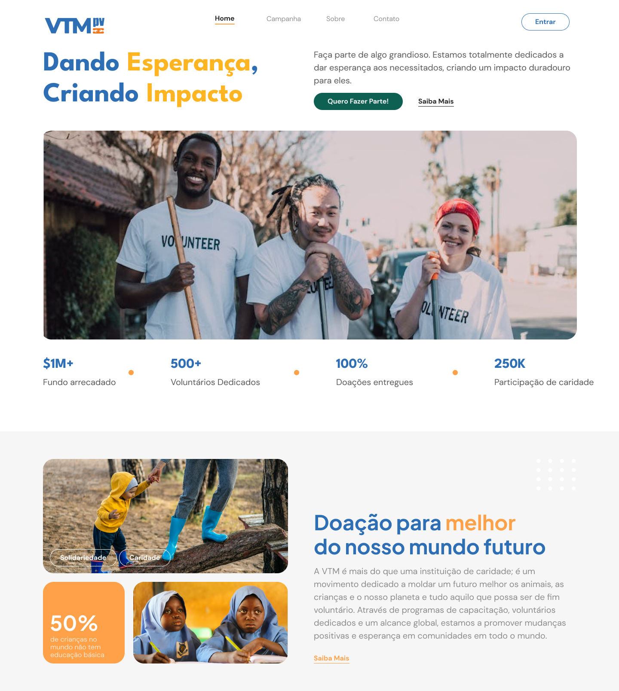 
   
   <sup>Fonte: Material produzido pelos autores (2024)</sup><br>

</div>

&nbsp;&nbsp;&nbsp;&nbsp;A *landind page* é a primeira página que o usuário verá antes de, de fato, entrar na plataforma. Ela busca dar uma breve explicação sobre a plataforma e mostrar algumas ações já realizadas através dela. A *landing page* também tem a função de ser chamativa e esteticamente agradável, a fim de atrair novos usuários. <br>
&nbsp;&nbsp;&nbsp;&nbsp;Prototipamos a página acima seguindo as regras do guia de estilos já estabelecidos e tendo como base os wireframes que fizemos na primeira sprint. Entrentanto, eventuais mudanças podem ter sido realizadas. <br>
&nbsp;&nbsp;&nbsp;&nbsp;É importante destacar que esta não é a página completa, mas sim apenas uma tela dela. Para visualizar todos os protótipos em alta fidelidade, acesse o link no Figma: <a href="https://www.figma.com/file/wN6wqurUq4HjiH0k1QbOWx/CSS-%7C-VTM-PV-Project?type=design&node-id=660%3A275&mode=design&t=0i1v3qyOmepefF51-1">https://www.figma.com/file/wN6wqurUq4HjiH0k1QbOWx/CSS-%7C-VTM-PV-Project?type=design&node-id=660%3A275&mode=design&t=0i1v3qyOmepefF51-1 </a>


<div align="center">
   
   <sub>Figura X - Protótipo em alta fidelidade da tela de login </sub>

   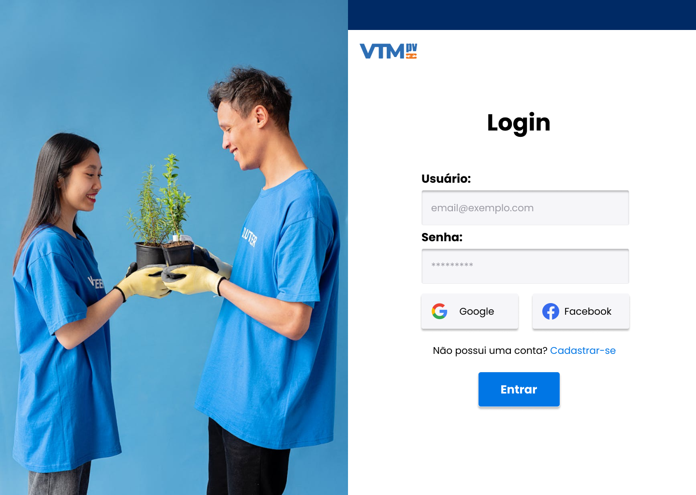 
   
   <sup>Fonte: Material produzido pelos autores (2024)</sup><br>

</div>

&nbsp;&nbsp;&nbsp;&nbsp;Para esta tela, o padrão estabelecido no wireframe foi fielmente aplicado, deixando uma grande imagem ao lado esquerdo e o formulário de login na direita. Destaca-se a possibilidade de realizar login com credenciais do Google ou Facebook, funcionalidade que temos a intenção de implementar.

<div align="center">
   
   <sub>Figura X - Protótipo em alta fidelidade da homepage </sub>

   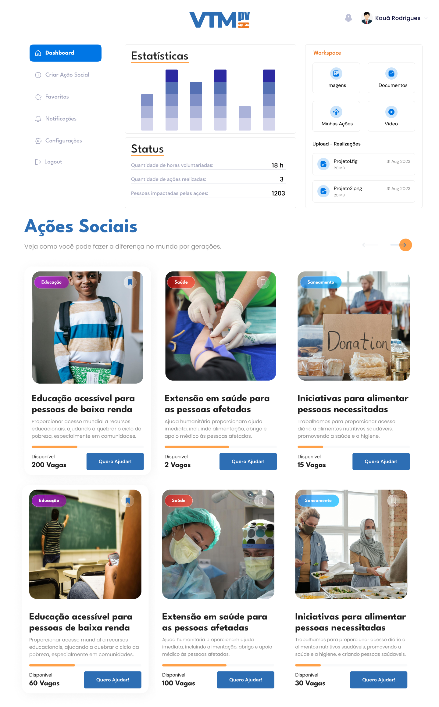 
   
   <sup>Fonte: Material produzido pelos autores (2024)</sup><br>

</div>

&nbsp;&nbsp;&nbsp;&nbsp;A *homepage* da aplicação foi prototipada como sendo a principal tela de toda a aplicação. É aqui onde os usuários poderão encontrar pessoas disponíveis para voluntariado, ou, no caso da imagem acima, ações de voluntariado ativas no momento e que precisam de candidatos. Além disso, essa página também mostra algumas estatísticas da plataforma, como o total de horas voluntariadas, por exemplo. Ademais, é por esta página que o usuário consegue acessar o seu perfil, obter detalhamento de ações sociais e se candidatar. 

<div align="center">
   
   <sub>Figura X - Protótipo em alta fidelidade da tela de perfil </sub>

   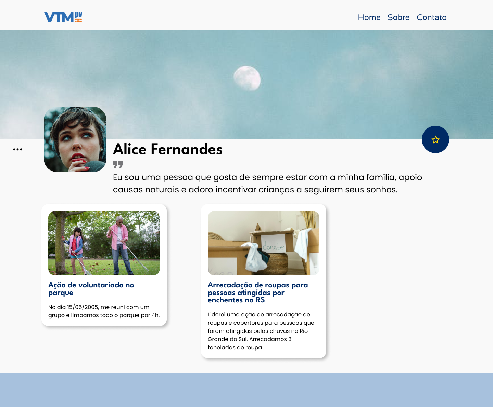 
   
   <sup>Fonte: Material produzido pelos autores (2024)</sup><br>

</div>

&nbsp;&nbsp;&nbsp;&nbsp;A página de perfil foi prototipada em alta fidelidade como tendo um objetivo central de ser simples e demonstrar as informações mais importantes sobre o usuário. É nessa página onde o usuário pode adicionar ações sociais nas quais tomou parte e editar informações sobre si mesmo, como sua biografia, por exemplo. 

<div align="center">
   
   <sub>Figura X - Protótipo em alta fidelidade da tela de criação de ação </sub>

   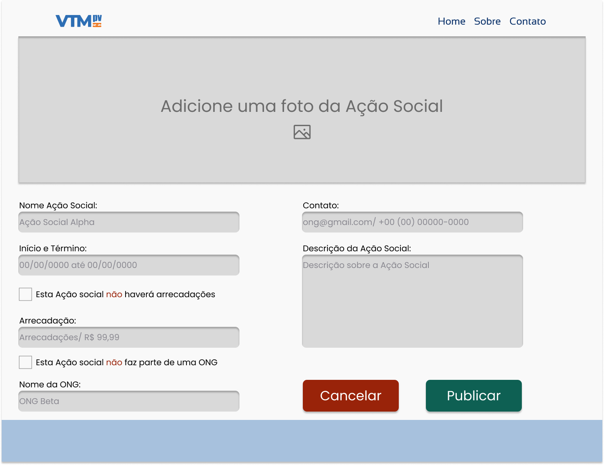 
   
   <sup>Fonte: Material produzido pelos autores (2024)</sup><br>

</div>

&nbsp;&nbsp;&nbsp;&nbsp;Por fim, a última tela que prototipamos é aquela onde um usuário comum ou responsável por uma organização social pode cadastrar uma nova oportunidade de ação na plataforma. Essa página é dedicada tanto para ONGs criando ações enormes como para usuários individuais que estejam querendo gerenciar ações sociais em seus bairros. Nesta tela, o usuário deve preencher informações como fotos, descrições e data de início e término. 
<br><br>

&nbsp;&nbsp;&nbsp;&nbsp;Todos esses protótipos foram pensados tendo a finalidade de nos ajudar a cumprir as principais *user stories* que possuímos no projeto, dizendo respeito ao principal fluxo de navegação que o usuário encontrará no *front-end* da aplicação. Dessa forma, buscamos cobrir as principais ações do usuário, como visitar a *landing page*, criar um perfil, ver as ações/voluntários disponíveis, se candidatar em uma ação, editar o seu perfil e cadastrar uma nova ação social. Novamente, reiteramos que algumas das páginas mostradas acima não estão completas, mas podem ser vistar em sua totalidade no link do Figma exposto no começo da seção. 

## 3.5. Modelagem do banco de dados (sprints 2 e 3)

&nbsp;&nbsp;&nbsp;&nbsp;Banco de Dados é uma coleção organizada de informações ou dados. Geralmente, esses dados são armazenados e acessados eletronicamente a partir de um sistema computacional. Bancos de dados facilitam o armazenamento, a modificação e a extração de informações de uma maneira organizada. Existem vários tipos de bancos de dados, como relacional, não relacional _(NoSQL)_, distribuído, entre outros.

&nbsp;&nbsp;&nbsp;&nbsp;O tipo de banco de dados que iremos utilizar será o modelo relacional. O modelo relacional é um tipo de banco de dados que armazena e fornece acesso a dados pontos que estão inter-relacionados. Baseia-se no modelo relacional, uma maneira em que uma tabela se relaciona com a outra. Em um banco de dados relacional, cada linha da tabela é um registro com uma identidade única, e cada coluna da tabela é um atributo que possui um tipo de dado específico. As tabelas podem ser relacionadas entre si através de chaves estrangeiras _(foreign keys)_.

### 3.5.1. Modelo relacional (sprints 2)

&nbsp;&nbsp;&nbsp;&nbsp;A estrutura do Esquema de Relacionamento do Banco de Dados (ERD) foi cuidadosamente projetada para atender às necessidades variadas de nossa plataforma. Com tabelas específicas para gerenciar perfis de usuários e empresas, projetos de voluntariado, e as interações dinâmicas entre esses entes, o ERD é o fundamento sobre o qual toda a funcionalidade do site é construída. A seguir, detalharei cada componente deste esquema, explicando como cada parte contribui para o objetivo geral do projeto e como essas interações são cruciais para a criação de uma comunidade de voluntariado vibrante e eficaz.

<div align="center">
   
   <sub> FIGURA X - Modelo Relacionado do Banco de Dados </sub>

    
   
   <sup>Fonte: Material produzido pelos autores (2024)</sup>
   
</div>

Arquivo xml do MEW, para visualização completa no [sql designer](https://sql.toad.cz/): [ERD Banco de Dados](outros/banco_dados.xml)

**Explicação do MER:**

1. **Perfil do Usuário (Perfil_usuario)**: Esta tabela é fundamental para armazenar informações sobre os usuários que se registram na plataforma. Inclui detalhes pessoais como nome, idade, e-mail, senha, cidade, estado e as horas que o usuário dedicou a trabalho voluntário. Esses dados permitem personalizar a experiência do usuário e facilitar a gestão de contas e comunicação.

   - Ela se relaciona com a tabela Voluntariado através de uma chave estrangeira (FK_idUsuario), indicando que cada registro de voluntariado está associado a um usuário.

   - Também se relaciona com Convite através das chaves estrangeiras FK_idUsuario(remetente) e FK_idUsuario(destinatário), o que permite enviar convites de um usuário para outro.

   - Código SQL para criação da tabela:

      ```sql
      CREATE TABLE IF NOT EXISTS "Perfil_usuario" (
         "idUsuario" SERIAL PRIMARY KEY,
         "nome" VARCHAR(50) NOT NULL DEFAULT 'NULL',
         "data_nascimento" DATE NOT NULL,
         "genero" VARCHAR(50) NOT NULL DEFAULT 'NULL',
         "email" VARCHAR(50) NOT NULL DEFAULT 'NULL',
         "senha" VARCHAR(100) NOT NULL DEFAULT 'NULL',
         "cidade" VARCHAR(50) NOT NULL DEFAULT 'NULL',
         "estado" VARCHAR(50) NOT NULL DEFAULT 'NULL',
         "horasTotais" DECIMAL NOT NULL DEFAULT NULL,
         "dataCriacao" DATE NOT NULL DEFAULT CURRENT_DATE
      );
      ```

2. **Perfil da Empresa (Perfil_empresa)**: Similar à tabela de usuário, mas focada em empresas ou organizações. Armazena informações como nome da empresa, CNPJ, cidade, estado, área de atuação e um telegone de contato. Isso é crucial para integrar organizações que desejam oferecer suporte a projetos de voluntariado ou criar seus próprios.

   - Está ligada a Empresas_por_projeto e Usuários_por_empresa. A tabela Empresas_por_projeto é uma tabela de junção que relaciona empresas a projetos específicos.

   - Código SQL para criação da tabela:

   ```sql
   CREATE TABLE IF NOT EXISTS "Perfil_empresa" (
      "idPerfil_empresa" SERIAL PRIMARY KEY,
      "nome" VARCHAR(50) NOT NULL DEFAULT 'NULL',
      "cnpj" BIGINT NOT NULL,
      "cidade" VARCHAR(50) NOT NULL DEFAULT 'NULL',
      "estado" VARCHAR(50),
      "dataCriacao" DATE NOT NULL DEFAULT CURRENT_DATE,
      "telefone" VARCHAR(11) NOT NULL,
      "atuacao" VARCHAR(50) NOT NULL
   );
   ```

3. **Projeto (Projeto)**: Central para a plataforma, esta tabela guarda informações sobre os projetos de voluntariado disponíveis, incluindo nome, descrição, data de criação, região, número de vagas e área de atuação. Facilita os usuários a encontrar projetos que correspondam aos seus interesses e habilidades.

   - Se relaciona com as tabelas Usuários_por_projeto e Empresas_por_projeto, que associam usuários e empresas a projetos específicos.

   - Código SQL para criação da tabela:

   ```sql  
   CREATE TABLE IF NOT EXISTS "Projeto" (
      "idProjeto" SERIAL PRIMARY KEY,
      "nome" VARCHAR(50) NOT NULL DEFAULT 'NULL',
      "area" VARCHAR(20) NOT NULL DEFAULT 'NULL',
      "descricao" VARCHAR(200) NOT NULL DEFAULT 'NULL',
      "cidade" VARCHAR(50) NOT NULL DEFAULT 'NULL',
      "estado" VARCHAR(50) NOT NULL DEFAULT 'NULL',
      "numeroVagas" INTEGER NOT NULL DEFAULT NULL,
      "dataCriacao" DATE NOT NULL DEFAULT CURRENT_DATE
   );
   ```

4. **Voluntariado (Voluntariado)**: Registra as atividades de voluntariado que os usuários se engajam. Inclui referências ao usuário e ao projeto associado, detalhes da atividade, status e horas trabalhadas. Essa tabela é essencial para rastrear o engajamento dos usuários e o impacto das atividades de voluntariado.

   - Está diretamente relacionada ao Perfil_usuario como mencionado. Devido a isso, cada registro de voluntariado está associado a um usuário.

   - Código SQL para criação da tabela:

   ```sql
   CREATE TABLE IF NOT EXISTS "Voluntariado" (
      "idVoluntariado" SERIAL PRIMARY KEY,
      "idUsuario" INTEGER NOT NULL,
      "titulo" VARCHAR(50) NOT NULL DEFAULT 'NULL',
      "descricao" VARCHAR(200),
      "horasTrabalhadas" DECIMAL NOT NULL DEFAULT NULL,
      "status" VARCHAR(50),
      "dataInicio" DATE NOT NULL DEFAULT CURRENT_DATE,
      "dataFim" DATE
   );
   ```

5. **Convite (Convite)**: Usada para gerenciar convites enviados entre usuários para participar de projetos ou entre projetos e usuários. Armazena informações sobre o remetente, destinatário, projeto relacionado, descrição e status do convite. Isso facilita a colaboração e a formação de equipes dentro da plataforma.

   - Relaciona-se com Perfil_usuario para identificar quem envia e quem recebe o convite, e com Projeto para especificar a que projeto o convite se refere.

   - Código SQL para criação da tabela:

   ```sql
   CREATE TABLE IF NOT EXISTS "Convite" (
      "idConvite" SERIAL PRIMARY KEY,
      "idUsuario_remetente" INTEGER NOT NULL,
      "idUsuario_destinatario" INTEGER NOT NULL,
      "idProjeto" INTEGER NOT NULL,
      "descricao" VARCHAR(200) NOT NULL DEFAULT 'NULL',
      "dataCriacao" DATE NOT NULL DEFAULT CURRENT_DATE,
      "status" VARCHAR(50)
   );
   ```

6. **Usuários por Projeto (Usuarios_por_projeto)** e **Empresas por Projeto (Empresas_por_projeto)**: Estas tabelas de junção são cruciais para relacionar múltiplos usuários e empresas a projetos específicos num relacionamento N:N. Elas permitem a associação de funções, registro de horas trabalhadas e a data de entrada, ajudando na organização e no gerenciamento dos recursos humanos e empresariais envolvidos nos projetos.

   - Interliga Perfil_usuario e Projeto, permitindo que múltiplos usuários sejam associados a múltiplos projetos.
   - Conecta a tabela Perfil_empresa com Projeto, atribuindo empresas a projetos específicos.

   - Código SQL para criação da tabela Usuarios_por_projeto:

   ```sql
   CREATE TABLE IF NOT EXISTS "Usuarios_por_Projeto" (
      "idUsuario" INTEGER NOT NULL,
      "idProjeto" INTEGER NOT NULL,
      "funcao" VARCHAR(50) NOT NULL DEFAULT 'NULL',
      "horasContadas" DECIMAL NOT NULL DEFAULT NULL,
      "dataEntrada" DATE NOT NULL DEFAULT CURRENT_DATE,
      PRIMARY KEY ("idUsuario", "idProjeto")
   );
   ```

   - Código SQL para criação da tabela Empresas_por_projeto:

   ```sql
   CREATE TABLE IF NOT EXISTS "Empresa_Projeto" (
      "idPerfil_empresa" INTEGER NOT NULL,
      "idProjeto" INTEGER NOT NULL,
      "area" VARCHAR(50) NOT NULL DEFAULT 'NULL',
      "horasContadas" DECIMAL,
      "dataCriacao" DATE NOT NULL DEFAULT CURRENT_DATE,
      PRIMARY KEY ("idPerfil_empresa", "idProjeto")
   );
   ```

7. **Usuários por Empresa (Usuarios_por_empresa)**: Facilita a gestão das relações de trabalho entre usuários e empresas, mantendo um registro de posições ocupadas, horas contabilizadas e a data de entrada de cada usuário em uma organização. Essa tabela é essencial para o acompanhamento da contribuição dos voluntários em contextos corporativos, facilitando o entendimento de como as empresas estão engajadas com a comunidade.

   - Associa Perfil_usuario e Perfil_empresa, permitindo que usuários sejam associados a empresas.

   - Código SQL para criação da tabela Usuarios_por_empresa:

   ```sql
   CREATE TABLE IF NOT EXISTS "Usuarios_por_Empresa" (
      "idPerfil_empresa" INTEGER NOT NULL,
      "idUsuario" INTEGER NOT NULL,
      "cargo" VARCHAR(50) NOT NULL DEFAULT 'NULL',
      "horasContadas" DECIMAL NOT NULL DEFAULT NULL,
      "dataEntrada" DATE NOT NULL DEFAULT CURRENT_DATE,
      PRIMARY KEY ("idPerfil_empresa", "idUsuario")
   );

   ```

   &nbsp;&nbsp;&nbsp;&nbsp;A estrutura desse banco de dados foi projetada para refletir e suportar as necessidades complexas de uma plataforma dedicada ao voluntariado. Com uma abordagem que integra tanto indivíduos quanto empresas em uma rede de projetos de impacto social.

&nbsp;&nbsp;&nbsp;&nbsp;Apos a criação das tabelas, é necessário criar as chaves estrangeiras para garantir a integridade referencial do banco de dados. As chaves estrangeiras são colunas ou combinações de colunas que são usadas para estabelecer e impor um link entre os dados de duas tabelas. A chave estrangeira é uma restrição que impede a destruição de um registro pai se houver registros filhos associados a ele. A seguir, apresentamos o código SQL para criação das chaves estrangeiras:

```sql
ALTER TABLE "Convite" ADD FOREIGN KEY ("idUsuario_remetente") REFERENCES "Perfil_usuario" ("idUsuario");

ALTER TABLE "Convite" ADD FOREIGN KEY ("idUsuario_destinatario") REFERENCES "Perfil_usuario" ("idUsuario");

ALTER TABLE "Convite" ADD FOREIGN KEY ("idProjeto") REFERENCES "Projeto" ("idProjeto");

ALTER TABLE "Usuarios_por_Empresa" ADD FOREIGN KEY ("idPerfil_empresa") REFERENCES "Perfil_empresa" ("idPerfil_empresa");

ALTER TABLE "Usuarios__por_Empresa" ADD FOREIGN KEY ("idUsuario") REFERENCES "Perfil_usuario" ("idUsuario");
ALTER TABLE "Empresa_Projeto" ADD FOREIGN KEY ("idPerfil_empresa") REFERENCES "Perfil_empresa" ("idPerfil_empresa");

ALTER TABLE "Empresa_por_Projeto" ADD FOREIGN KEY ("idProjeto") REFERENCES "Projeto" ("idProjeto");

ALTER TABLE "Usuarios__por_Projeto" ADD FOREIGN KEY ("idUsuario") REFERENCES "Perfil_usuario" ("idUsuario");

ALTER TABLE "Usuarios_por_Projeto" ADD FOREIGN KEY ("idProjeto") REFERENCES "Projeto" ("idProjeto");

ALTER TABLE "Voluntariado" ADD FOREIGN KEY ("idUsuario") REFERENCES "Perfil_usuario" ("idUsuario");

```

&nbsp;&nbsp;&nbsp;&nbsp;Para a visualização completa do código SQL do banco de dados, acesse o arquivo [comandos_sql.sql](outros/comandos_sql.sql).


### 3.5.2. Consultas SQL e lógica proposicional (sprint 3)

**Consultas SQL:** <br>
&nbsp;&nbsp;&nbsp;&nbsp;A Consulta SQL é um tipo de comando usado para interagir com bancos de dados. Esses comandos permitem executar operações como buscar, inserir, atualizar e deletar dados em tabelas de um banco de dados. A estrutura de uma consulta SQL geralmente inclui cláusulas como SELECT, FROM, e WHERE, que determinam o que será buscado, de onde, e sob quais condições, respectivamente. Dentro da linguagem SQL (Structured Query Language), possuímos alguns comandos essenciais:
* SELECT - É utilizado para especificar quais colunas de dados você deseja recuperar de uma ou mais tabelas no banco de dados. Você pode selecionar uma ou várias colunas e também aplicar funções para manipular os dados retornados.
* FROM - É usado para indicar a tabela de onde os dados devem ser retirados. Este comando sempre acompanha o SELECT, informando de qual tabela os campos especificados devem ser buscados. 
* WHERE - É usado para filtrar registros, retornando apenas aqueles que cumprem uma condição específica. Ele é muito útil para refinar os resultados de uma consulta SELECT, UPDATE ou DELETE.

**Lógica proposicional:** <br>
&nbsp;&nbsp;&nbsp;&nbsp;A lógica proposicional é uma área da matemática que estuda a manipulação de proposições através de operadores lógicos para formar novas proposições. A lógica proposicional é usada para construir argumentos, resolver problemas que envolvem condições verdadeiras ou falsas. Na lógica proposicional, utilizam-se símbolos específicos para representar proposições e suas relações. Aqui estão alguns dos principais símbolos:
1. **Negação (¬)**
Representa a negação de uma proposição. Se \( p \) é uma proposição, \( ¬p \) é a negação de \( p \).
2. **Conjunção (∧)**
Representa a conjunção (e) entre duas proposições. Se \( p \) e \( q \) são proposições, \( p ∧ q \) é verdadeiro somente quando ambas as proposições \( p \) e \( q \) são verdadeiras.
3. **Disjunção (∨)**
Representa a disjunção (ou) entre duas proposições. Se \( p \) e \( q \) são proposições, \( p ∨ q \) é verdadeiro quando pelo menos uma das proposições \( p \) ou \( q \) é verdadeira.
4. **Implicação (→)**
Representa a implicação (se... então). Se \( p \) e \( q \) são proposições, \( p → q \) é falso somente quando \( p \) é verdadeiro e \( q \) é falso.
5. **Bicondicional (↔)**
Representa a bicondicional (se e somente se). Se \( p \) e \( q \) são proposições, \( p ↔ q \) é verdadeiro quando \( p \) e \( q \) são ambos verdadeiros ou ambos falsos.

&nbsp;&nbsp;&nbsp;&nbsp;Além disso, na lógica proposicional, podemos utilizar de um artefato chamado de “tabela verdade”, que serve para dizer quando que uma proposição é verdadeira e quando que é falsa.

**Relacionamento entre consultas SQL e lógica proposicional:** <br>
&nbsp;&nbsp;&nbsp;&nbsp;As consultas em SQL se relacionam com a lógica proposicional através do uso de operadores lógicos que definem condições para selecionar, inserir, atualizar ou deletar dados em um banco de dados. Essa relação é feita porque a lógica proposicional fornece uma base formal para definir e avaliar condições que podem ser verdadeiras ou falsas. Ou seja, através da lógica proposicional, podemos analisar uma consulta SQL muito mais profundamente e entender como cada atributo desta consulta a afeta como um todo. <br>

&nbsp;&nbsp;&nbsp;&nbsp;Separamos aqui algumas consultas que serão de grande importância no desenvolvimento da nossa plataforma web. Além disso, também destacamos as lógicas proposicionais que regem essas consultas e a tabela verdade de cada consulta.

#1 | Seleção de organizações que atuem em determinada área
--- | ---
**Expressão SQL** | SELECT nome, cidade, estado FROM Perfil_empresa WHERE atuacao LIKE 'Tecnologia' OR atuacao LIKE 'Educação';
**Proposições lógicas** | $A$: A atuação é na área de 'Tecnologia' (atuacao LIKE 'Tecnologia') <br> $B$: A atuação é na área de 'Educação' (atuacao LIKE 'Educação')
**Expressão lógica proposicional** | $A \lor B$
**Tabela Verdade** | <table> <thead> <tr> <th>$A$</th> <th>$B$</th> <th>$A \lor B$</th> </tr> </thead> <tbody> <tr> <td>F</td> <td>F</td> <td>F</td> </tr> <tr> <td>F</td> <td>V</td> <td>V</td> </tr> <tr> <td>V</td> <td>F</td> <td>V</td> </tr> <tr> <td>V</td> <td>V</td> <td>V</td> </tr> </tbody> </table>


&nbsp;&nbsp;&nbsp;&nbsp;Na expressão #1, temos a seleção de todas as organizações sociais que atuam em alguma de duas áreas determinadas. Podemos ver que possuímos duas proposições A e B, e que para que retornemos uma consulta com sucesso e resultados, a preposição A OU a preposição B devem ser verdadeiras. Isso implica que a consulta apenas retorna um valor falso quando A e B são falsos, ou seja, a organização social (empresa) não atua nem no segmento A e nem no segmento B.
<br>

#2 | Listar convites pendentes para um usuário
--- | ---
**Expressão SQL** | SELECT idConvite, descricao, dataCriacao FROM Convite WHERE idUsuario_destinatario = 2 AND status = 'Pendente';
**Proposições lógicas** | $A$: O id do destinatário é igual a 2 (idUsuario_destinatario = 2). Este id pode ser substituido pelo id de qualquer usuário <br> $B$: O O usuário que recebeu o convite ainda não o leu (status = 'Pendente')
**Expressão lógica proposicional** | $A \land B$
**Tabela Verdade** | <table> <thead> <tr> <th>$A$</th> <th>$B$</th> <th>$A \land B$</th> </tr> </thead> <tbody> <tr> <td>F</td> <td>F</td> <td>F</td> </tr> <tr> <td>F</td> <td>V</td> <td>F</td> </tr> <tr> <td>V</td> <td>F</td> <td>F</td> </tr> <tr> <td>V</td> <td>V</td> <td>V</td> </tr> </tbody> </table>


&nbsp;&nbsp;&nbsp;&nbsp;Para a segunda proposição lógica, temos uma consulta de todos os convites que foram enviados para um usuário sobre algum projeto e que ainda não foram respondidos. Dessa forma, a consulta possui duas proposições, A e B, e essas proposições se relacionam por meio de uma proposição do tipo E, ou seja, a consulta só retorna verdadeiro se A E B forem verdadeiros. Portanto, caso um usuário, por exemplo, não possua convites pendentes, a consulta não retorna nada. 
<br>

#3 | Selecionar voluntariados (ações sociais) ativos ou concluídos de um usuário específico
--- | ---
**Expressão SQL** | SELECT titulo, descricao, horasTrabalhadas, FROM Voluntariado, WHERE idUsuario = 3 AND status IN ('Ativo', 'Concluído');
**Proposições lógicas** |  $A$: O id do usuário é 3 (idUsuario = 3) <br> $B$: O status é 'Ativo' (status = 'Ativo') <br> $C$: O status é 'Concluído' (status = 'Concluído')
**Expressão lógica proposicional** | $A \land (B \lor C)$
**Tabela Verdade** | <table> <thead> <tr> <th>$A$</th> <th>$B$</th> <th>$C$</th> <th>$B \lor C$</th> <th>$A \land (B \lor C)$</th> </tr> </thead> <tbody> <tr> <td>F</td> <td>F</td> <td>F</td> <td>F</td> <td>F</td> </tr> <tr> <td>F</td> <td>F</td> <td>V</td> <td>V</td> <td>F</td> </tr> <tr> <td>F</td> <td>V</td> <td>F</td> <td>V</td> <td>F</td> </tr> <tr> <td>F</td> <td>V</td> <td>V</td> <td>V</td> <td>F</td> </tr> <tr> <td>V</td> <td>F</td> <td>F</td> <td>F</td> <td>F</td> </tr> <tr> <td>V</td> <td>F</td> <td>V</td> <td>V</td> <td>V</td> </tr> <tr> <td>V</td> <td>V</td> <td>F</td> <td>V</td> <td>V</td> </tr> <tr> <td>V</td> <td>V</td> <td>V</td> <td>V</td> <td>V</td> </tr> </tbody> </table>


&nbsp;&nbsp;&nbsp;&nbsp;Na terceira consulta, selecionamos todas as ações de voluntariado que um usuário específico está ativo ou concluiu. Para esta consulta, temos 3 preposições, A, B e C. Essas preposições se relacionam de modo que a consulta somente retornará valores caso A e a proposição B OU C sejam ambas verdadeiras.
<br>

#4 | Ver a quantidade de horas que um usuário trabalhou em todos os seus projetos
--- | ---
**Expressão SQL** | SELECT SUM(horasTrabalhadas) AS totalHoras FROM Voluntariado WHERE idUsuario = 3;
**Proposições lógicas** |  $A$: O id do usuário é 3 (idUsuario = 3, pode ser qualquer outro usuário) <br> $B$: As horas trabalhadas são contabilizadas (horasTrabalhadas não é NULL)
**Expressão lógica proposicional** | $A \land B$
**Tabela Verdade** | <table> <thead> <tr> <th>$A$</th> <th>$B$</th> <th>$A \land B$</th> </tr> </thead> <tbody> <tr> <td>F</td> <td>F</td> <td>F</td> </tr> <tr> <td>F</td> <td>V</td> <td>F</td> </tr> <tr> <td>V</td> <td>F</td> <td>F</td> </tr> <tr> <td>V</td> <td>V</td> <td>V</td> </tr> </tbody> </table>


&nbsp;&nbsp;&nbsp;&nbsp;Na consulta de número 4, desejamos ver a quantidade total de horas que um usuário já dedicou ao voluntariado na plataforma, fazendo isso por meio de duas proposições: Um id para o usuário, que pode ser qualquer usuário que queremos verificar, e a quantidade de horas que ele já trabalhou. Esta consulta está como uma preposição do tipo E por que os dois valores precisam ser diferentes de NULL para que a consulta possa ser realizada efetivamente. x'
<br>

#5 | Selecionar os nomes e funções dos usuários em um projeto específico
--- | ---
**Expressão SQL** | SELECT u.nome, up.funcao FROM Usuarios_Projeto up JOIN Perfil_usuario u ON up.idUsuario = u.idUsuario WHERE up.idProjeto = 10;
**Proposições lógicas** |  $A$: O id do projeto é 10 (idProjeto = 10)
**Expressão lógica proposicional** | $A$
**Tabela Verdade** |<table> <thead> <tr> <th>$A$</th> <th>$A$</th> </tr> </thead> <tbody> <tr> <td>F</td> <td>F</td> </tr> <tr> <td>V</td> <td>V</td> </tr> </tbody> </table>

&nbsp;&nbsp;&nbsp;&nbsp;Nesta consulta, temos um exemplo onde desejamos ver todos os usuários e suas funções em um determinado projeto. Possuímos apenas uma proposição A, sendo esta o id de qualquer projeto cadastrado na plataforma. Dessa forma, a consulta só deixa de retornar valores caso o projeto não exista na plataforma (id inválido).

#6 | Voluntariados concluídos na área de tecnologia por um usuário específico
--- | ---
**Expressão SQL** | SELECT * FROM Voluntariado WHERE idUsuario = 3 AND status = 'Concluído' AND descricao LIKE '%tecnologia%';
**Proposições lógicas** |  $A$: O id do usuário é 3 (idUsuario = 3) <br> $B$: O voluntariado já foi concluído (status = 'Concluído') <br> $C$: A descrição do voluntariado contém a palavra 'tecnologia' (descricao LIKE '%tecnologia%')
**Expressão lógica proposicional** | $A \land B \land C$
**Tabela Verdade** | <table> <thead> <tr> <th>$A$</th> <th>$B$</th> <th>$C$</th> <th>$A \land B \land C$</th> </tr> </thead> <tbody> <tr> <td>F</td> <td>F</td> <td>F</td> <td>F</td> </tr> <tr> <td>F</td> <td>F</td> <td>V</td> <td>F</td> </tr> <tr> <td>F</td> <td>V</td> <td>F</td> <td>F</td> </tr> <tr> <td>F</td> <td>V</td> <td>V</td> <td>F</td> </tr> <tr> <td>V</td> <td>F</td> <td>F</td> <td>F</td> </tr> <tr> <td>V</td> <td>F</td> <td>V</td> <td>F</td> </tr> <tr> <td>V</td> <td>V</td> <td>F</td> <td>F</td> </tr> <tr> <td>V</td> <td>V</td> <td>V</td> <td>V</td> </tr> </tbody> </table>


&nbsp;&nbsp;&nbsp;&nbsp;Para a sexta consulta, buscamos as ações sociais que um usuário específico realizou em uma determinada área. Por exemplo, podemos querer saber todas as ações sociais que um usuário realizou que envolvessem tecnologia. Para essa consulta, possuímos 3 proposições: A, B e C, que se relacionam com uma proposição do tipo E, ou seja, ambos A, B e C têm que ser verdadeiros para que a consulta retorne resultados. 
<br>

#7 | Atualizar informações de um projeto (ação social)
--- | ---
**Expressão SQL** | UPDATE Projeto SET nome = 'Novo Nome', descricao = 'Nova Descrição', cidade = 'Nova Cidade', estado = 'Novo Estado', numeroVagas = 20 WHERE idProjeto = 1;
**Proposições lógicas** | $A$: O id do projeto é 1 (idProjeto = 1)
**Expressão lógica proposicional** | $A$
**Tabela Verdade** | <table> <thead> <tr> <th>$A$</th> <th>$A$</th> </tr> </thead> <tbody> <tr> <td>F</td> <td>F</td> </tr> <tr> <td>V</td> <td>V</td> </tr> </tbody> </table>

&nbsp;&nbsp;&nbsp;&nbsp;Para a sétima e última consulta, trazemos um exemplo de UPDATE, onde um usuário pode atualizar as informações sobre uma ação social. Nesta consulta, apenas a proposição A (id do projeto = id válido de alguma ação da plataforma) é usada na cláusula WHERE. Dessa forma, a consulta retorna verdadeiro (altera os dados da ação) apenas se tal ação existir na plataforma. 
<br>
&nbsp;&nbsp;&nbsp;&nbsp;Através dessas lógicas e tabelas, podemos prever quais serão os resultados de cada consulta SQL que faremos no banco de dados, bem com entender como que cada atributo da consulta influencia a *querie* como um todo. 

## 3.6. WebAPI e endpoints (sprint 3)

_Utilize um link para outra página de documentação contendo a descrição completa de cada endpoint. Ou descreva aqui cada endpoint criado para seu sistema._

_Cada endpoint deve conter endereço, método (GET, POST, PUT, PATCH, DELETE), header, body e formatos de response_

# <a name="c4"></a>4. Desenvolvimento da Aplicação Web

&nbsp;&nbsp;&nbsp;&nbsp;Nesta seção, falaremos brevemente sobre como ocorreu o desenvolvimento da projeto durante as suas 10 semanas de execução, buscando detalhar como e porque o time tomou tais decisões, quais desafios encontramos e o que entregamos ao final de cada sprint. Vale ressaltar que a seção 4.1, que aborda a primeira versão da aplicação web, contempla as primeiras 6 semanas do projeto, e, por isso, é mais longa.

## 4.1. Primeira versão da aplicação web (sprint 3)

&nbsp;&nbsp;&nbsp;&nbsp;As duas primeiras sprints do projeto foram focadas na estruturação do que iríamos desenvolver, bem como no entendimento do negócio da Parceiros Voluntários e o entendimento do problema que nos foi trazido. Assim, passamos a primeira sprint apenas no processo de entendimento de que tipo de solução o parceiro queria, fazendo isso principalmente por meio de um workshop onde pudemos tirar diversas dúvidas sobre a plataforma que iremos desenvolver. Além disso, focamos muito no entendimento dos possíveis usuários dessa futura plataforma e fizemos isso por meio da criação de proto personas. 

<div align="center">
   
   <sub>Figura X - Persona: Rogério Scrum </sub>

    
   
   <sup>Fonte: Material produzido pelos autores (2024)</sup>
   
</div>

&nbsp;&nbsp;&nbsp;&nbsp;Além disso, na primeira sprint também desenvolvemos boa parte da arquitetura de software do projeto, desenvolvendo nosso primeiro esboço de Arquitetura MVC e modelo de banco de dados. Além disso, no que tange o entendimento de negócio, fizemos a análise das 5 Forças de Porter do Setor, bem como a Análise SWOT da O.N.G. Parceiros Voluntários e uma Matriz de Riscos do projeto. A principal dificuldade que enfrentamos nesta primeira sprint envolveu um desalinhamento de objetivos entre os membros do grupo, algo que pôde ser resolvido após sessões de conversa.

&nbsp;&nbsp;&nbsp;&nbsp;O final da primeira sprint e o começo da segunda foi marcado pelo foco que tivemos principalmente em desenvolver uma estrutura rudimentar para a plataforma web, fazendo isso por meio da criação de wireframes e protótipos em alta fidelidade no Figma. A principal dificuldade que encontramos nesta segunda sprint foi a quantidade elevada de telas que tivemos que desenvolver em alta fidelidade. Como alguns membros não possuíam experiência com a ferramenta, acabaram por levar mais tempo do que o esperado. Além disso, como cada membro acabou desenvolvendo uma tela diferente, enfrentamos problemas porque as telas ficaram com estéticas não tão semelhantes.

<div align="center">
   
   <sub>Figura X - Protótipo em alta fidelidade da landing page </sub>

    
   
   <sup>Fonte: Material produzido pelos autores (2024)</sup><br>

</div>

&nbsp;&nbsp;&nbsp;&nbsp;Além disso, na segunda sprint, trabalhamos muito para desenvolver um guia de estilos para a aplicação e uma primeira versão já funcional da plataforma web. Em relação ao guia de estilos, por meio de reuniões grupais, definimos paletas de cores, tipografia e ícones a serem utilizados no projeto. Além disso, sobre a primeira versão funcional da plataforma, enfrentamos muita dificuldade no que diz respeito ao framework que estamos utilizando, o Sails Js, uma vez que todo o grupo teve problemas em assimilar esta nova tecnologia e implementá-la no projeto. Entretanto, mesmo com as dificuldades, conseguimos entregar uma primeira tela de login/cadastro funcional, que já cadastrava com sucesso um usuário no banco de dados.

<div align="center">
   
   <sub>Figura X -Primeira versão da aplicação WEB - Parte 1 </sub>

   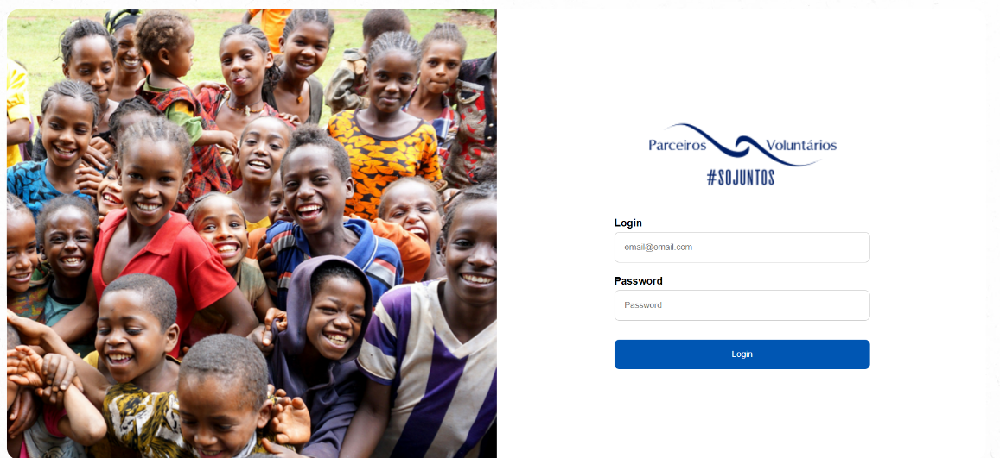 
   
   <sup>Fonte: Material produzido pelos autores (2024)</sup><br>

</div>

&nbsp;&nbsp;&nbsp;&nbsp;Para a terceira sprint do projeto, o grupo possuía o objetivo de entregar uma versão minimamente funcional da aplicação web, já realizando cadastros e consultas no banco de dados por meio da WebAPI. Além disso, foi necessário realizar importantes atualizações acerca da modelagem do banco de dados e da arquitetura de software. <br> 
&nbsp;&nbsp;&nbsp;&nbsp;A primeira semana da sprint foi marcada, principalmente, pelas atualizações de pontos importantes do projeto. Focamos muito em atualizar o guia de estilos e protótipos de alta fidelidade que desenvolvemos na sprint 2, a fim de ter uma boa base definida para quando começarmos a codificar o *front-end* da aplicação. Nesta etapa, a principal dificuldade que encontramos foi o fato de que, infelizmente, os protótipos em alta fidelidade foram construídos sem seguir as regras do guia de estilos. Por conta disso, o grupo teve que ajustar muitos aspectos tanto do protótipo como do guia de estilos, incluindo tipografia, cores e distanciamento entre elementos.

<div align="center">
   
   <sub> FIGURA X - Protótipo em alta fidelidade atualizado na sprint 3 </sub>

    
   
   <sup>Fonte: Material produzido pelos autores (2024)</sup>
   
</div>


&nbsp;&nbsp;&nbsp;&nbsp;Em termos de código, nesta sprint o grupo consolidou a interface de cadastro e login de usuário, já realizando um sistema de autenticação utilizando o Firebase, uma ferramenta de desenvolvimento do Google que facilita a autenticação de usuários em plataformas web.

```javascript
emailLogin: async function (req, res) {
    let email = req.body.email;
    let password = req.body.password;

    try {
      const result = await auth.signInWithEmailAndPassword(auth.getAuth(), email, password);
      const user = result.user;

      //autoriza o usuário
      req.session.authenticated = true;
      req.session.userId = user.uid;

      // Salvar informações do usuário no banco de dados ou realizar outras ações
      console.log(user);
      return res.json({ user });
    } catch (error) {
      console.error(error);
      return res.status(500).json({ error: error.message });
    }
  }
```

&nbsp;&nbsp;&nbsp;&nbsp;Além da autenticação, o grupo caminhou bem no desenvolvimento de um *front-end* rudimentar para as principais telas que teremos na aplicação. Desta forma, desenvolvemos uma tela para criação de ações, uma landing page, e a home da aplicação. Além disso, criamos controllers para lidar com o *back-end* da aplicação, principalmente para criação e leitura de informações de usuários na plataforma. 

```javascript
//Controller para ler usuario apartir do id
  read: async function (req, res) {
    try {
      let id = req.params.id;
      const perfilUsuario = await Usuario.findOne({ id });
      if (!perfilUsuario) {
        return res.status(404).json({ error: 'Usuário não encontrado' });
      }
      return res.status(200).json(perfilUsuario);
    } catch (error) {
      return res.status(500).json({ error: 'Erro ao buscar usuário' });
    }
  }
```

&nbsp;&nbsp;&nbsp;&nbsp;Para o código, a principal dificuldade encontrada foi a criação de *policies* no framework sailsjs. As *policies* servem para impedir que um usuário não-autenticado consiga acessar determinada página. Tivemos dificuldade em fazer isso por conta da falta de conhecimento do framework, mas contornamos esse obstáculo por meio da leitura da documentação do Sails e observação de como isso era feito no projeto de exemplo que o framework oferece. Ao final da terceira sprint, tínhamos as seguintes telas com back-end funcionando:<br>

<div align="center">
   
   <sub> FIGURA X - Tela de login atualizada na sprint 3 </sub>

   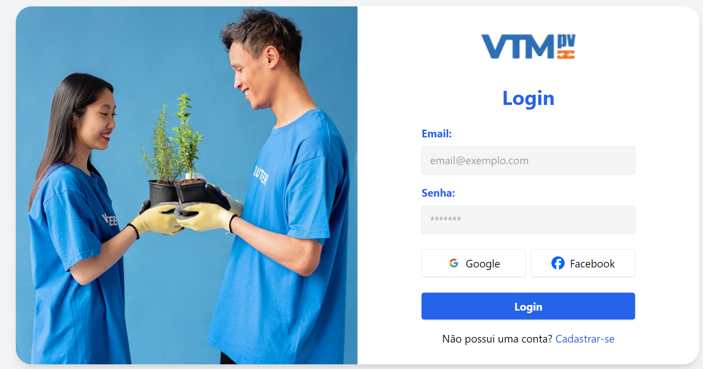 
   
   <sup>Fonte: Material produzido pelos autores (2024)</sup>
   
</div>

&nbsp;&nbsp;&nbsp;&nbsp;Já implementamos a tela de login de acordo com o que planejamos no protótipo de alta fidelidade. Utilizando o framework de CSS Tailwind, não tivemos problemas em tornar a tela responsiva.

<div align="center">
   
   <sub> FIGURA X - Homepage feita na sprint 3 </sub>

   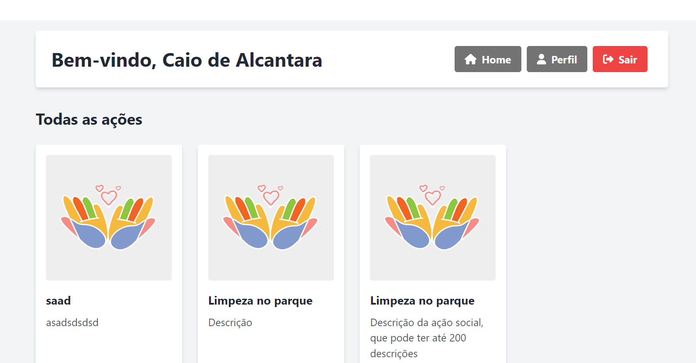 
   
   <sup>Fonte: Material produzido pelos autores (2024)</sup>
   
</div>

&nbsp;&nbsp;&nbsp;&nbsp;Para esta tela, o frontend realmente não foi a prioridade. Apenas desenvolvemos uma tela que tem como objetivo mostar que estamos pegando os dados de usuários e ações já cadastradas no banco de dados.

<div align="center">
   
   <sub> FIGURA X - Página de perfil feita na sprint 3 </sub>

   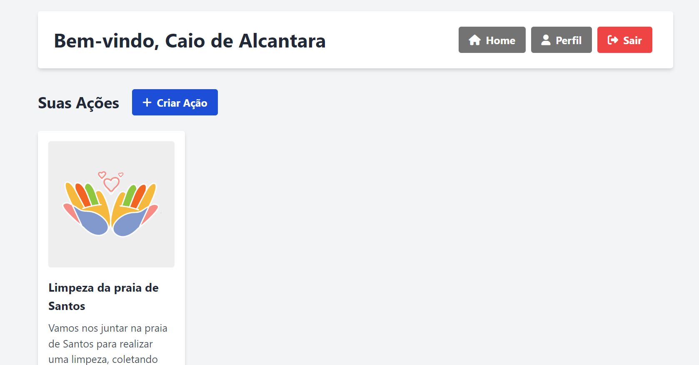 
   
   <sup>Fonte: Material produzido pelos autores (2024)</sup>
   
</div>

&nbsp;&nbsp;&nbsp;&nbsp;Nesta tela, também focamos muito mais no backend, que tinha a funcionalidade de já buscar no banco de dados as informações sobre o usuário logado. Além disso, o perfil também mostra as ações sociais que o usuário já realizou ou está realizando. 

<div align="center">
   
   <sub> FIGURA X - Página de criação de ação feita na sprint 3 </sub>

   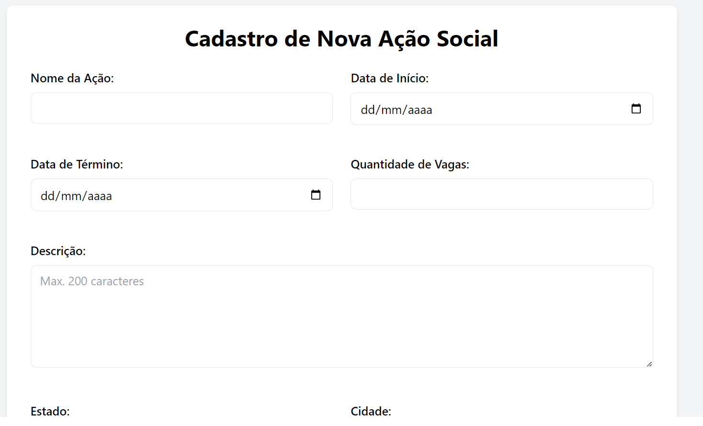 
   
   <sup>Fonte: Material produzido pelos autores (2024)</sup>
   
</div>

&nbsp;&nbsp;&nbsp;&nbsp;Por fim, trazemos a página onde um usuário pode criar uma ação social por meio do preenchimento de um formulário com diversos dados sobre a ação proposta. É necessário ressaltar que todas essas telas já estão, na sprint 3, com a integração entre *frontend* e *backend* finalizadas. 

&nbsp;&nbsp;&nbsp;&nbsp;Por fim, focamos a segunda semana da sprint 3 no refinamento e desenvolvimento um pouco mais aprofundado para o *back-end* da aplicação, também prestando atenção na documentação, preenchendo a seção 3.5.2, com consultas SQL e suas respectivas preposições, bem como as tabelas verdade que regem essas preposições. 

## 4.2. Segunda versão da aplicação web (sprint 4)

_Descreva e ilustre aqui o desenvolvimento da sua segunda versão do sistema web, explicando brevemente o que foi entregue em termos de código e sistema. Utilize prints de tela para ilustrar. Indique as eventuais dificuldades e próximos passos._

## 4.3. Versão final da aplicação web (sprint 5)

_Descreva e ilustre aqui o desenvolvimento da última versão do sistema web, explicando brevemente o que foi entregue em termos de código e sistema. Utilize prints de tela para ilustrar. Indique as eventuais dificuldades e próximos passos._

# <a name="c5"></a>5. Testes

## 5.1. Relatório de testes automatizados (sprint 4)

_Liste e descreva os testes automatizados planejados para sua solução. Posicione aqui também o relatório de testes (através de link ou transcrito para estrutura markdown)_

## 5.2. Testes de usabilidade (sprint 5)

### 5.2.1 Registros de testes e melhorias

_Posicione aqui as tabelas com enunciados de tarefas, etapas e resultados de testes de usabilidade. Ou utilize um link para seu relatório de testes (mantenha o link sempre público para visualização)_

# <a name="c6"></a>6. Conclusões e trabalhos futuros (sprint 5)

_Escreva de que formas a solução da aplicação web atingiu os objetivos descritos na seção 2 deste documento. Indique pontos fortes e pontos a melhorar de maneira geral._

_Relacione os pontos de melhorias evidenciados nos testes com planos de ações para serem implementadas. O grupo não precisa implementá-las, pode deixar registrado aqui o plano para ações futuras_

_Relacione também quaisquer outras ideias que o grupo tenha para melhorias futuras_

# <a name="c7"></a>7. Referências (sprints 1 a 5)

MAGRETTA, J. Entendendo Michael Porter. [s.l: s.n.]. Disponível em: https://www.amazon.com.br/Entendendo-Michael-Porter-Competição-Estratégia/dp/8550807486. Acesso em: 22 abr.<br>

CASAROTTO, C. As 5 forças de Porter: o que são, para que servem e como aplicar? Rock Content, 11 dez. 2020. <br>

HOFRICHTER, M. Analise Swot; Quando Usar E Como Fazer. S.L.: Simplissimo, 2020. <br>

GABRIEL. Panorama sobre a Utilização das Técnicas e Ferramentas de Gerenciamento de Riscos em Projetos. Boletim do Gerenciamento, v. 21, n. 21, p. 23–31, 30 dez. 2020. <br>

HARLEY, A. Personas Make Users Memorable for Product Team Members. Disponível em: <https://www.nngroup.com/articles/persona/>. Acesso em 23 abr. <br>

COHN, M.; BECK, K. User stories applied : for agile software development. Boston Etc.: Addison-Wesley, , Cop, 2011. <br>

FORD, N. et al. Software Architecture: The Hard Parts. [s.l.] “O’Reilly Media, Inc.”, 2021. <br>

WILLIAM PEREIRA ALVES. Java para Web – Desenvolvimento de Aplicações. [s.l.] Saraiva Educação S.A., 2018.

OSTERWALDER, A.; BERNARDA, G.; YVES PIGNEUR. Value Proposition Design. [s.l.] Alta Books, 2019.

Wireframe: O Que É e Como Criar Um Para Seus Projetos De UX Design? - Aela School. Disponível em: <https://aelaschool.com/pt/designdeinteracao/wireframe-o-que-e-como-desenhar/> Acesso em 26 abr.

Style Guide: Como Desenvolver o Guia de Estilo da Sua Interface? - Aela School. Disponível em: <https://aelaschool.com/pt/designvisual/style-guide-como-desenvolver-o-guia-de-estilo-da-sua-interface/>. Acesso em: 2 maio. 2024.

‌
‌

‌

# <a name="c8"></a>Anexos

_Inclua aqui quaisquer complementos para seu projeto, como diagramas, imagens, tabelas etc. Organize em sub-tópicos utilizando headings menores (use ## ou ### para isso)_
